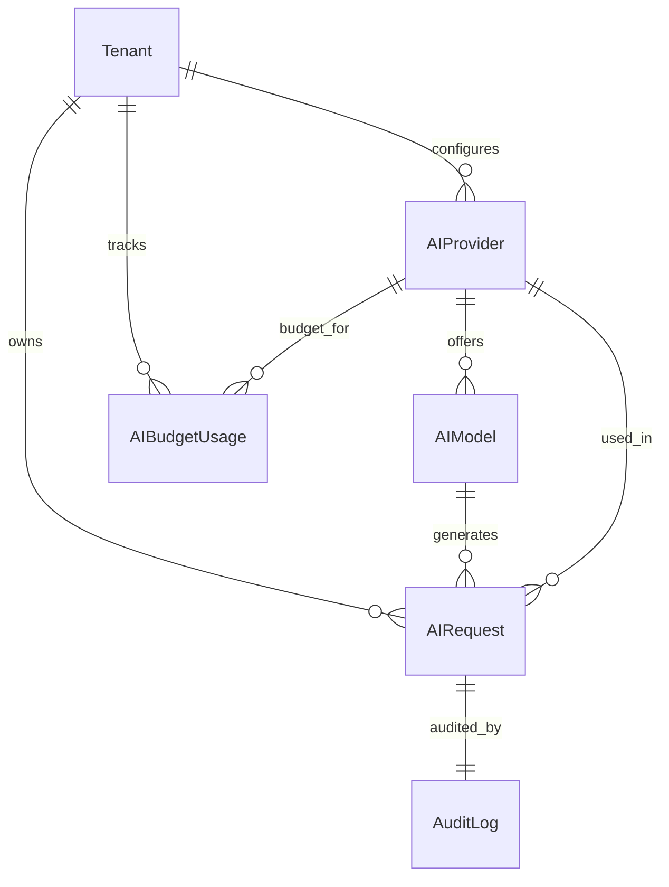

<!-- SPDX-License-Identifier: Apache-2.0 -->
# AI Provider Configuration - Comprehensive Design Document

**Version:** 1.0.0
**Last Updated:** 2025-12-02
**Status:** Architecture Design
**Development Agent:** Agent 36

---

## Table of Contents

1. [Executive Summary](#executive-summary)
2. [Market Research & Competitive Analysis](#market-research--competitive-analysis)
3. [Core Features](#core-features)
4. [Resources & Data Model](#resources--data-model)
5. [AI Agents & Automation](#ai-agents--automation)
6. [API Specification](#api-specification)
7. [Security & Permissions](#security--permissions)
8. [Integration Architecture](#integration-architecture)

---

## Executive Summary

### Purpose

The AI Provider Configuration module is the **central orchestration layer** for all Large Language Model (LLM) and AI providers inside SARAISE. It exposes a **single, provider‑agnostic interface** to the rest of the platform while handling provider discovery, configuration, routing, monitoring, cost management, and governance behind the scenes.

This module exists to:
- Eliminate provider lock‑in by abstracting SAP‑style \"one vendor\" assumptions.
- Allow SARAISE to **switch, combine, and fail over** across 30+ cloud and self‑hosted models without touching downstream modules.
- Provide **hard, auditable guarantees** around cost, performance, and compliance for every AI call.

### Business Value Proposition

| Metric                                  | Industry (ERP + AI add‑ons) | SARAISE Target                 | Improvement              |
|-----------------------------------------|-----------------------------|-------------------------------|--------------------------|
| Providers supported per tenant          | 1–3                         | 30+ (cloud + self‑hosted)     | 10–20x breadth           |
| AI infra change lead time               | 4–12 weeks                  | < 1 day (config‑only change)  | 90%+ faster              |
| AI cost per 1K tokens (blended)         | Baseline                    | 30–40% lower via routing      | 30–40% cheaper           |
| AI‑related incident MTTR                | Days                        | < 1 hour with health + failover | 80%+ reduction        |
| % features broken by model deprecation  | 10–20%                      | 0% (version abstraction)      | Complete decoupling      |

### Competitive Advantage

| Feature                     | SAP (BTP AI Core / Joule)                         | Oracle (OCI GenAI / Fusion)                      | SARAISE AI Provider Configuration                                 | Our Advantage                                             |
|----------------------------|----------------------------------------------------|--------------------------------------------------|-------------------------------------------------------------------|-----------------------------------------------------------|
| Provider breadth           | Primarily SAP/partner models on BTP               | Oracle‑hosted models on OCI                      | 30+ cloud + on‑prem + open‑source providers                       | Orders of magnitude more choice                           |
| Unified API across vendors | Partial (SAP SDK abstractions)                    | Provider‑specific APIs                           | Single, strict Django REST Framework + SDK interface across all providers | True multi‑vendor abstraction                             |
| Intelligent routing        | Basic routing, no cross‑vendor optimization       | None beyond load balancing                       | Cost/latency/quality‑aware routing + failover + A/B testing       | Cost + resilience optimizations competitors lack          |
| Self‑hosted models         | Limited, deeply tied to SAP infra                 | Focus on OCI services                            | First‑class support for vLLM, Ollama, HF TGI, LocalAI, etc.       | Enterprise‑grade hybrid + on‑prem story                   |
| Cost governance            | Basic budgets, mostly at account level            | Basic quotas                                     | Per‑tenant, per‑module, per‑user budgets + semantic caching       | Fine‑grained, ERP‑grade cost controls                     |
| Observability              | Provider‑level metrics, not tenant‑scoped         | Cloud metrics; limited multi‑tenant semantics    | Tenant‑scoped request logs, budgets, health, quality KPIs         | Better multi‑tenant visibility + compliance               |
| Integration effort         | Heavy SAP configuration + ABAP/BTP extensions     | OCI‑centric dev work                             | Pure Python SDK + REST; entirely metadata‑driven per tenant       | Faster implementation, lower skill barrier                |

---

## Market Research & Competitive Analysis

### Industry Overview

Enterprise ERPs (SAP S/4HANA, Oracle Fusion/NetSuite, Microsoft Dynamics 365, Salesforce, Odoo) are bolting AI capabilities on top of legacy stacks via **single‑cloud providers** (Azure OpenAI, OCI Generative AI, Salesforce Einstein, SAP BTP AI Core). Their AI layers are:
- **Tightly coupled** to their own cloud infrastructure.
- Focused on **a small set of curated models**.
- Optimized for **incremental assistance** (copilots, assistants), not multi‑provider orchestration.

Specialized vendors (e.g., LangChain‑as‑a‑platform, PromptLayer, LiteLLM gateways) provide routing and observability, but they:
- Are **not multi‑tenant ERP‑aware**.
- Don’t own the transactional + workflow context SARAISE has.
- Rarely implement **strict RBAC, tenant isolation, and audit** at the level we require.

The gap: a **governed, multi‑tenant AI provider layer** deeply integrated into ERP workflows, cost centers, and compliance.

### Competitor Deep Dive

#### SAP (S/4HANA + BTP AI Core / Joule)

**Approach:**
SAP exposes AI through **Joule** (the SAP copilot) and **AI Core/Launchpad** on BTP. Providers are configured at the platform level; customers primarily consume SAP‑hosted models or SAP‑approved third‑party models via BTP.

**Strengths:**
- Tight integration with S/4HANA, SuccessFactors, Ariba, etc.
- Enterprise‑grade governance and compliance.
- Prebuilt scenarios (financial close, procurement, HR).

**Weaknesses:**
- Strong bias toward **SAP cloud + SAP‑approved models**; very limited choice outside that ecosystem.
- No truly pluggable \"bring any LLM\" story with uniform multi‑provider routing.
- AI provider configuration buried in BTP operations; **not a first‑class tenant‑level concept** for customers.

**Pricing:**
Usage‑based, often bundled into BTP consumption; opaque for customers; little cross‑provider optimization.

#### Oracle (Fusion / NetSuite + OCI Generative AI)

**Approach:**
Oracle exposes GenAI via OCI; Fusion apps (ERP, HCM, CX) and NetSuite hook into OCI models. The default path is **Oracle‑hosted models** with tight OCI coupling.

**Strengths:**
- End‑to‑end stack (database, OCI, Fusion apps).
- Enterprise security posture.

**Weaknesses:**
- Provider choice essentially means \"Oracle + a couple of OCI‑integrated models\".
- No cross‑cloud routing; no serious semantic caching or cost optimization.
- AI provider configuration is an infra concern, not a **meta‑configurable ERP module**.

#### Microsoft Dynamics 365 (Copilot + Azure OpenAI)

**Approach:**
Dynamics Copilot runs almost exclusively on **Azure OpenAI**. Customers might bring their own Azure subscriptions, but the model set is constrained to Azure‑approved models.

**Strengths:**
- Very strong Copilot UX embedded in Sales, Service, Finance, etc.
- Tight integration with Power Platform and Fabric/Power BI.

**Weaknesses:**
- **Single‑cloud, essentially single‑gateway** (Azure OpenAI).
- No generic abstraction for Anthropic, Google, self‑hosted, or open‑source LLMs.
- Routing is feature‑specific, not a configurable, tenant‑level strategy.

#### Salesforce Einstein / Odoo / Specialized Vendors

**Salesforce Einstein 1:** tightly tied to Data Cloud and Salesforce metadata; provider choice is heavily constrained, optimization is a Salesforce black box.
**Odoo:** early AI features (e.g., chat, draft email) backed by specific models; no orchestration layer.
**LiteLLM, Portkey, LangSmith, LangChain hub:** decent **LLM gateway** capabilities (routing, logging, caching) but zero ERP‑grade multi‑tenant context or subscription awareness.

### Market Gaps & SARAISE Opportunities

| Gap                                                | Competitor Weakness                                              | SARAISE Solution                                                                                  |
|----------------------------------------------------|------------------------------------------------------------------|---------------------------------------------------------------------------------------------------|
| Multi‑provider, multi‑tenant orchestration         | Single‑cloud, tightly coupled AI stacks                         | Pluggable 30+ provider registry with tenant‑scoped, metadata‑driven configuration                |
| Cost and performance optimization across vendors   | Basic cost tracking, no real routing or semantic caching        | Cost/latency/quality‑aware router + semantic cache + budget engine per tenant/department/module  |
| ERP‑aware governance and audit                     | AI logs scattered across infra; poor tenant‑level visibility    | First‑class Resources for providers/models/usage + immutable AuditLog entries for every AI call   |
| Hybrid/on‑prem AI                                  | Cloud‑only or vendor DC only                                    | Native support for vLLM/Ollama/TGI behind VPN/VPC, governed just like cloud providers            |
| Fast adaptation to model evolution                 | Slow vendor certification cycles; feature freezes                | Model registry + A/B testing + version management decoupled from business feature releases       |

---

## Core Features

Below are the **implemented** and **planned** features for this module. The README already describes many; this section re‑frames them as architectural capabilities with user stories and acceptance criteria.

### Feature Category 1: Provider & Model Registry

#### Feature 1.1: Multi‑Provider Registry

**Description:** Maintain a catalog of all AI providers (cloud and on‑prem) available to the platform, with tenant‑scoped overrides and configuration.

**User Story:**
As a **platform owner**, I want to register global AI providers and allowed models so that tenants can opt‑in without custom deployment work.

**Acceptance Criteria:**
- [ ] Platform owner can create/edit/disable providers and models via API and UI.
- [ ] Tenant admin can see which providers are available globally and which are enabled for their tenant.
- [ ] Registry enforces uniqueness on `(tenant_id, provider_name, model_name, version)`.

**Competitive Comparison:**

| Aspect                  | SAP               | Oracle            | SARAISE                         |
|-------------------------|------------------|-------------------|---------------------------------|
| Multi‑tenant visibility | Limited          | Limited           | Explicit tenant + platform view |
| Self‑hosted support     | Niche            | No                | First‑class                     |

#### Feature 1.2: Tenant‑Scoped Provider Overrides

**Description:** Allow tenants to override platform defaults (e.g., bring their own OpenAI key, enable different models).

**User Story:**
As a **tenant admin**, I want to configure my own API keys and preferred models so I’m not forced to use platform‑level contracts.

**Acceptance Criteria:**
- [ ] Tenant‑level providers are stored with `tenant_id` and isolated via schema‑per‑tenant.
- [ ] Session‑based auth ensures a tenant admin can only see/edit their own providers.
- [ ] RBAC ensures only `platform_owner`, `platform_operator`, `tenant_admin`, and `tenant_developer` can manage providers.

### Feature Category 2: Routing & Optimization

#### Feature 2.1: Intelligent Provider Routing

**Description:** Route AI requests across providers based on strategy (cost, latency, quality, failover).

**User Story:**
As a **tenant admin**, I want to pick a routing strategy per workload so that my support bots use cheaper models while financial agents use higher‑quality ones.

**Acceptance Criteria:**
- [ ] Router supports strategies: `cost_optimized`, `latency_optimized`, `quality_optimized`, `balanced`, `failover`.
- [ ] Routing configuration is a Resource stored per tenant, per workload (module/agent).
- [ ] When primary provider is down, router automatically fails over following the configured chain and logs the event.

#### Feature 2.2: Semantic Caching

**Description:** Cache responses for identical or highly similar prompts to reduce cost and latency.

**User Story:**
As a **platform operator**, I want popular prompts (e.g., standard reports) served from cache so we don’t waste tokens and CPU.

**Acceptance Criteria:**
- [ ] Exact‑match and semantic caching with configurable TTL per tenant and per module.
- [ ] Cache hit/miss surfaced in API responses and AuditLog.
- [ ] Cache entries are tenant‑scoped; no cross‑tenant leakage.

### Feature Category 3: Governance, Budgets, and Observability

#### Feature 3.1: Budget Management

**Description:** Enforce per‑tenant, per‑module, per‑user budget limits with alerts and hard cut‑offs.

**User Story:**
As a **tenant billing manager**, I want to cap AI spend and receive alerts when we approach our budget so there are no surprise invoices.

**Acceptance Criteria:**
- [ ] Budget Resource defines daily/monthly limits and alert thresholds.
- [ ] Once budget is exceeded and `auto_cutoff` is enabled, further calls are blocked with `429` + explicit error.
- [ ] All budget events are immutably logged in `AuditLog`.

#### Feature 3.2: Provider Health & Analytics

**Description:** Capture latency, error rates, token usage, and quality metrics per provider/model, per tenant.

**User Story:**
As a **platform operator**, I want a dashboard showing which providers are healthy and cost‑efficient so I can adjust defaults.

**Acceptance Criteria:**
- [ ] `ai_requests` table stores per‑call metrics.
- [ ] Aggregated views available via `/api/v1/ai/usage`, `/costs`, `/performance`, `/health`.
- [ ] Health state drives routing and failover decisions.

*(Additional features such as model version management, prompt management, and rate limiting are already detailed in the module README and reused here as canonical capabilities.)*

---

## Resources & Data Model

This module **does not introduce its own physical tables** directly; instead it defines canonical Resource schemas that are implemented via Django ORM models under `backend/src/modules/ai_provider_configuration/models.py` and enforced through metadata modeling rules.

### Resource Overview

| Resource             | Purpose                                           | Key Fields (examples)                                           | Relationships                                     |
|---------------------|---------------------------------------------------|------------------------------------------------------------------|--------------------------------------------------|
| `AIProvider`        | Provider registry (platform + tenant overrides)   | `tenant_id`, `provider_name`, `provider_type`, `config`, `status` | Links to `AIModel`, `AIBudgetUsage`, `AIRequest` |
| `AIModel`           | Individual models under a provider                | `provider_id`, `model_name`, `version`, `capabilities`, `pricing` | Links to `AIProvider`, `AIRequest`               |
| `AIRequest`         | Immutable log of each AI call                     | `tenant_id`, `user_id`, `module_name`, `provider_id`, `model_id` | Links to `AIProvider`, `AIModel`, `AuditLog`     |
| `AICacheEntry`      | Cached responses for prompts                      | `prompt_hash`, `completion_text`, `model_name`, `expires_at`     | None; read via routing layer                     |
| `AIBudgetUsage`     | Budget tracking per tenant + provider/period      | `tenant_id`, `provider_id`, `period_type`, `total_cost`, `limit` | Links to `AIProvider`                            |
| `AIRoutingPolicy`   | Workload‑level routing policy                     | `tenant_id`, `module_name`, `strategy`, `thresholds`             | References `AIProvider` and `AIModel`            |

### Example Resource Definition: `AIProvider`

```python
{
    "resource_type": "AIProvider",
    "module": "ai-provider-configuration",
    "fields": [
        {"fieldname": "scope", "fieldtype": "Select", "label": "Scope", "options": "platform\ntenant", "default": "tenant", "reqd": 1},
        {"fieldname": "tenant_id", "fieldtype": "Link", "options": "Tenant", "label": "Tenant", "reqd": 0},
        {"fieldname": "provider_name", "fieldtype": "Data", "label": "Provider Name", "reqd": 1},
        {"fieldname": "provider_type", "fieldtype": "Select", "options": "cloud\nself_hosted", "reqd": 1},
        {"fieldname": "enabled", "fieldtype": "Check", "label": "Enabled", "default": 1},
        {"fieldname": "config", "fieldtype": "JSON", "label": "Configuration", "reqd": 1},
        {"fieldname": "api_key_encrypted", "fieldtype": "Password", "label": "Encrypted API Key"},
        {"fieldname": "api_endpoint", "fieldtype": "Data", "label": "Custom Endpoint"},
        {"fieldname": "rate_limit_per_minute", "fieldtype": "Int", "label": "Rate Limit / Minute"},
        {"fieldname": "monthly_budget_limit", "fieldtype": "Currency", "label": "Monthly Budget Limit"},
        {"fieldname": "status", "fieldtype": "Select", "options": "active\ndisabled\nerror", "default": "active"},
        {"fieldname": "health_status", "fieldtype": "Select", "options": "healthy\ndegraded\ndown", "default": "healthy"},
        {"fieldname": "last_health_check", "fieldtype": "Datetime", "label": "Last Health Check"}
    ],
    "permissions": [
        {"role": "platform_owner", "read": 1, "write": 1, "create": 1, "delete": 1},
        {"role": "platform_operator", "read": 1, "write": 1, "create": 1, "delete": 0},
        {"role": "tenant_admin", "read": 1, "write": 1, "create": 1, "delete": 0},
        {"role": "tenant_developer", "read": 1, "write": 1, "create": 0, "delete": 0}
    ],
    "validate": "validate_ai_provider_scope_and_tenant"
}
```

**Field Specifications (excerpt):**

| Field                 | Type      | Required                        | Validation                                                                | Description                                                                 |
|-----------------------|-----------|---------------------------------|---------------------------------------------------------------------------|-----------------------------------------------------------------------------|
| `scope`               | Select    | Yes                             | `platform` or `tenant`                                                   | Scope of the provider (`platform` = global, `tenant` = tenant‑scoped)      |
| `tenant_id`           | Link      | Conditionally required          | Required when `scope='tenant'`; must equal current session `tenant_id`   | Tenant that owns the provider; **must** be null when `scope='platform'`    |
| `provider_name`       | Data      | Yes                             | Lowercase slug                                                            | Logical provider ID (`openai`, `anthropic`, etc.)                           |
| `provider_type`       | Select    | Yes                             | `cloud` or `self_hosted`                                                 | Drives infra behavior and health checks                                     |
| `config`              | JSON      | Yes                             | Schema‑validated per provider                                            | Provider‑specific configuration blob                                        |
| `api_key_encrypted`   | Password  | No                              | AES‑256‑GCM, Vault‑backed                                               | Encrypted API key or credential material                                    |
| `monthly_budget_limit`| Currency  | No                              | ≥ 0                                                                       | Budget cap before hard cutoff                                               |

### Entity Relationship Diagram (Logical)



---

## AI Agents & Automation

This module itself is largely **backend orchestration**, but it exposes rich hooks for AI agents that automate provider onboarding, optimization, and troubleshooting.

### Agent 1: Provider Configuration Assistant

**Purpose:**
Help tenant admins and platform operators configure providers, test connectivity, and enforce governance policies.

**Trigger:**
- User asks Ask Amani to \"configure OpenAI/Claude/Gemini for our tenant\".
- Tenant admin opens the AI provider configuration UI and clicks \"Let AI configure\".

**Actions:**
1. Collects necessary credentials and configuration parameters from the user.
2. Validates provider connectivity using `/api/v1/ai-providers/{id}/test`.
3. Suggests sane defaults for budgets, rate limits, and routing policies.
4. Writes `AIProvider` and `AIModel` Resources under the tenant scope.

**Governance:**
- Any change to API keys or budget limits requires `tenant_admin` or `platform_owner` approval.
- All configuration changes are immutably logged with `AuditLog` including before/after diffs.

### Agent 2: Cost Optimization Analyst

**Purpose:**
Continuously analyze AI usage records and recommend cheaper or faster provider/model combinations without degrading quality.

**Trigger:**
- Scheduled nightly job per tenant.
- Manual \"Optimize AI costs\" command from Ask Amani.

**Actions:**
1. Reads `AIRequest` and `AIBudgetUsage` for the last N days.
2. Detects high‑volume workloads and maps them to candidate cheaper models.
3. Simulates projected savings and proposes routing policy changes.
4. Raises approval tasks for `tenant_billing_manager` or `tenant_admin`.

**Governance:**
- Agent **never** changes routing in production without explicit approval.
- Proposed changes are stored as draft `AIRoutingPolicy` revisions.

### Workflow Automations (Examples)

| Workflow                                  | Trigger                                 | Conditions                                | Actions                                                                 | Outcome                                                |
|-------------------------------------------|-----------------------------------------|-------------------------------------------|-------------------------------------------------------------------------|--------------------------------------------------------|
| Provider Health Auto‑Failover             | Provider health = `down`                | Workload has fallback chain configured    | Update routing policy; route traffic to next provider in chain         | Minimal downtime for AI‑powered features              |
| Budget Enforcement                        | Budget usage > 100%                     | `auto_cutoff = true`                      | Block further completion calls for that tenant/provider                 | Hard cap on spend, clean error to callers             |
| Cost Anomaly Detection                    | Cost spike vs. historical baseline      | Spike > threshold                         | Alert `tenant_billing_manager`; flag affected workflows                 | Early detection of misconfiguration or abuse          |

### Ask Amani Integration

Ask Amani exposes conversational commands such as:
- \"Show me which AI providers we are using and their spend this month.\"
- \"Configure Anthropic Claude for our finance workflows with a $500/month budget.\"
- \"Which workloads could move from GPT‑4 to GPT‑4.1 mini or Claude Haiku without hurting quality?\"

Responses are backed by `AIProvider`, `AIModel`, `AIRequest`, and `AIBudgetUsage` Resources plus routing policies.

---

## API Specification

### Endpoints Overview

| Method | Endpoint                                  | Description                                              | Auth                       |
|--------|-------------------------------------------|----------------------------------------------------------|----------------------------|
| POST   | `/api/v1/ai-providers/`                  | Create **tenant‑scoped** provider for current tenant     | Tenant admin/developer     |
| GET    | `/api/v1/ai-providers/`                  | List providers visible to current tenant                 | Authenticated              |
| GET    | `/api/v1/ai-providers/{id}`              | Get provider details (enforces tenant/scope)             | Authenticated + RBAC       |
| PUT    | `/api/v1/ai-providers/{id}`              | Update **tenant‑scoped** provider                        | Tenant admin/developer     |
| DELETE | `/api/v1/ai-providers/{id}`              | Soft‑delete/disable **tenant‑scoped** provider           | Tenant admin               |
| POST   | `/api/v1/platform/ai-providers/`         | Create/update **platform‑level** providers               | Platform owner/operator    |
| GET    | `/api/v1/platform/ai-providers/`         | List **platform‑level** providers                        | Platform roles             |
| POST   | `/api/v1/ai-providers/{id}/test`         | Test provider connectivity                               | Admin roles only           |
| GET    | `/api/v1/ai-providers/{id}/models`       | List models configured under provider                    | Authenticated              |
| POST   | `/api/v1/ai-providers/{id}/models`       | Add/enable model under provider                          | Admin roles only           |
| POST   | `/api/v1/ai/complete`                    | Unified text completion                                  | Authenticated              |
| POST   | `/api/v1/ai/stream`                      | Streaming completion                                     | Authenticated              |
| POST   | `/api/v1/ai/embed`                       | Embeddings generation                                    | Authenticated              |
| POST   | `/api/v1/ai/moderate`                    | Content moderation                                       | Authenticated              |
| GET    | `/api/v1/ai/usage`                       | Usage analytics                                          | Tenant/platform analytics  |
| GET    | `/api/v1/ai/costs`                       | Cost breakdown                                           | Billing roles              |
| GET    | `/api/v1/ai/performance`                 | Provider/model performance metrics                       | Operator roles             |
| GET    | `/api/v1/ai/budget`                      | Current budget status                                    | Billing/admin              |
| POST   | `/api/v1/ai/budget`                      | Configure budgets                                        | Billing/admin              |

*(Endpoint shapes follow SARAISE's existing Django REST Framework + DRF serializer patterns; see README for concrete schemas already drafted.)*

---

## Security & Permissions

### Role-Based Access Control (RBAC)

RBAC is enforced using SARAISE’s **session‑based auth + Redis‑cached roles**. Key rules:

| Role                      | Create Providers                    | Read Providers                                    | Update Providers                    | Delete/Disable         | View Usage/Costs | Configure Budgets |
|---------------------------|-------------------------------------|--------------------------------------------------|-------------------------------------|------------------------|------------------|-------------------|
| `platform_owner`          | ✅ (`scope=platform` or `tenant`)   | ✅ (all scopes, all tenants)                      | ✅ (all scopes, all tenants)        | ✅                    | ✅               | ✅                |
| `platform_operator`       | ✅ (`scope=platform` or `tenant`)   | ✅ (all scopes, all tenants)                      | ✅ (all scopes, all tenants)        | ❌                    | ✅               | ❌                |
| `platform_auditor`        | ❌                                  | ✅ (read‑only, all scopes)                        | ❌                                  | ❌                    | ✅               | ❌                |
| `tenant_admin`            | ✅ (`scope=tenant`, own `tenant_id`)| ✅ (`scope=tenant`, own `tenant_id`)              | ✅ (`scope=tenant`, own `tenant_id`)| ❌                    | ✅ (tenant)      | ✅ (tenant)       |
| `tenant_developer`        | ✅ (`scope=tenant`, own `tenant_id`)| ✅ (`scope=tenant`, own `tenant_id`)              | Limited (`config` only)            | ❌                    | Limited          | ❌                |
| `tenant_billing_manager`  | ❌                                  | Limited (cost views for own tenant)              | ❌                                  | ❌                    | ✅ (tenant)      | ✅ (tenant)       |
| `tenant_viewer`           | ❌                                  | Limited (read‑only, own tenant where permitted)  | ❌                                  | ❌                    | ❌               | ❌                |

**Enforcement rules:**
- Tenant‑scoped endpoints (`/api/v1/ai-providers/*`) **do not accept `scope` or `tenant_id` from the client**; the backend forces `scope='tenant'` and `tenant_id = current_user.tenant_id`.
- Platform‑scoped endpoints (`/api/v1/platform/ai-providers/*`) accept `scope`/`tenant_id` but validate:
  - If `scope='platform'` → `tenant_id` must be null.
  - If `scope='tenant'`  → non‑null `tenant_id` required.

Every protected route declares an explicit dependency like `RequirePlatformOwner`, `RequireTenantAdmin`, etc. No \"implicit\" checks buried in route logic.

### Data Privacy

- API keys and credentials are **never** returned once stored.
- Sensitive payloads (`prompt_text`, `completion_text`) are stored only when explicitly enabled for debugging and redacted for PII in production.
- All storage and transport follows secrets + ports rules in `.cursor/rules/15-secrets-management.mdc` and `16-ports-cors.mdc`.
- Tenants are isolated with **schema‑per‑tenant** and explicit `tenant_id` checks on all queries.

### Audit Trail

All sensitive operations are logged via `AuditLog`:
- Provider create/update/delete.
- API key changes and rotations.
- Budget changes and overrides.
- Routing policy changes.
- Access to detailed AI usage reports.

Audit entries include `actor_sub`, `tenant_id`, `resource = "ai_provider_configuration"`, `action`, and `result`, satisfying SARAISE‑10001/10002.

---

## Integration Architecture

### Internal Module Integration

| Module                 | Integration Type        | Data Flow                                              | Trigger                                  |
|------------------------|-------------------------|--------------------------------------------------------|------------------------------------------|
| AI Agent Management    | Service + Resource link | Agents reference providers/models for execution       | Agent execution                          |
| Workflow Automation    | Service call           | Workflows call `/api/v1/ai/complete` for steps        | Workflow engine steps                    |
| Ticketing/Service Desk | Service call           | Use configured providers for summaries/classification | Ticket creation/update                   |
| Analytics              | Read‑only analytics    | Consume `AIRequest`, `AIBudgetUsage` for dashboards   | Scheduled jobs / on‑demand queries       |
| Billing & Subscriptions| Usage metering         | Map AI cost to subscription + quota modules           | AIRequest insertion                      |

### External System Integration

- **Cloud AI Providers:** Standard HTTPS REST calls using provider SDKs (OpenAI, Anthropic, Google, Azure, etc.).
- **Self‑Hosted AI:** Connect via internal URL/VPN; endpoints modeled as providers with `provider_type = self_hosted`.
- **Observability Stack:** Push metrics to Prometheus/Grafana via SARAISE monitoring rules; logs aggregated in Loki.

### Webhook Events

Selected events are exposed for downstream automation:

| Event                          | Payload (excerpt)                                        | Use Case                                      |
|--------------------------------|----------------------------------------------------------|-----------------------------------------------|
| `ai.provider.health_changed`   | `tenant_id`, `provider_id`, `old_status`, `new_status`  | Trigger failover or alerting                  |
| `ai.budget.threshold_reached`  | `tenant_id`, `provider_id`, `threshold`, `usage`        | Notify billing managers, adjust routing       |
| `ai.routing.policy.updated`    | `tenant_id`, `policy_id`, `changed_by`                  | Governance and change‑management reporting    |

---

**Last Updated:** 2025-12-02
**License:** Apache-2.0
