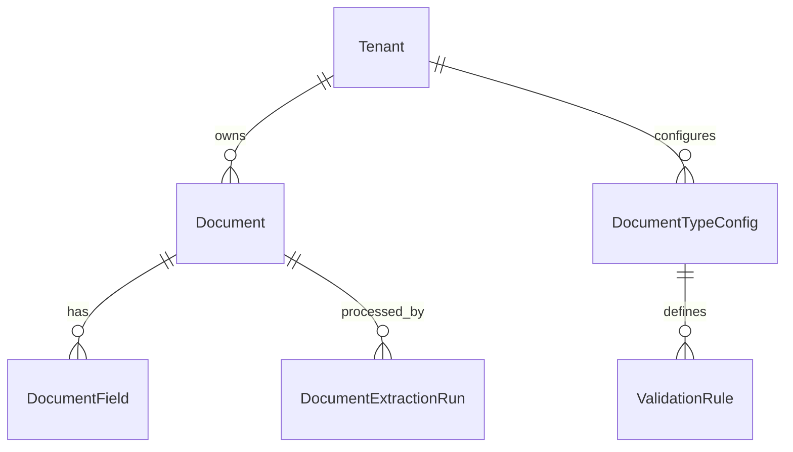

<!-- SPDX-License-Identifier: Apache-2.0 -->
# Document Intelligence - Comprehensive Design Document

**Version:** 1.0.0
**Last Updated:** 2025-12-02
**Status:** Architecture Design
**Development Agent:** Agent 39

---

## Table of Contents

1. [Executive Summary](#executive-summary)
2. [Market Research & Competitive Analysis](#market-research--competitive-analysis)
3. [Core Features](#core-features)
4. [Resources & Data Model](#resources--data-model)
5. [AI Agents & Automation](#ai-agents--automation)
6. [API Specification](#api-specification)
7. [Security & Permissions](#security--permissions)
8. [Integration Architecture](#integration-architecture)

---

## Executive Summary

### Purpose

The Document Intelligence module provides **intelligent document processing (IDP)** for SARAISE: ingesting invoices, purchase orders, contracts, forms, and unstructured documents; classifying them; extracting structured fields; validating against business rules; and routing into the right ERP workflows. It sits between raw content (PDFs, images, emails) and SARAISE’s multi‑tenant transactional models.

This module exists to:
- Automate data entry and document triage across finance, procurement, HR, and operations.
- Enforce **consistent validation and compliance** on all inbound documents.
- Feed high‑quality, structured data into SARAISE modules and analytics.

### Business Value Proposition

| Metric                             | Industry Baseline (SAP DOX, Textract, Form Recognizer, UiPath DU) | SARAISE Target                         | Improvement                    |
|------------------------------------|--------------------------------------------------------------------|----------------------------------------|--------------------------------|
| Manual keying effort per document  | 60–90 seconds                                                      | ≤ 10 seconds (review‑only)             | 80–90% reduction               |
| Straight‑through processing rate   | 30–60%                                                             | ≥ 85% on well‑trained document types   | +25–55 points                  |
| Extraction accuracy on core fields | 90–95%                                                             | ≥ 98% after training + validation      | Fewer corrections              |
| Time‑to‑onboard new doc layout     | Weeks (template definition, coding)                               | ≤ 2 days using training + rules        | Big reduction in lead time     |

### Competitive Advantage

| Feature                         | SAP DOX / SAP Capture           | Azure Form Recognizer / Textract     | UiPath / ABBYY                       | SARAISE Document Intelligence                                          | Our Advantage                                             |
|---------------------------------|----------------------------------|--------------------------------------|--------------------------------------|------------------------------------------------------------------------|-----------------------------------------------------------|
| ERP‑native workflows            | Strong for SAP only             | Generic, needs glue                  | Generic, process‑automation focused | Native integration with SARAISE procurement, AP, HR, etc.             | Less glue, more vertical integration                     |
| Multi‑tenant ERP SaaS          | Usually per‑enterprise tenancy  | Custom per customer                  | Custom deployments                  | Schema‑per‑tenant with tenant‑scoped configs and models               | Clean SaaS‑multi‑tenant architecture                     |
| Model choice (LLM + OCR)       | SAP models + limited options    | Azure/AWS only                      | Vendor models                        | Abstraction over OCR/vision + SARAISE AI Provider (36) for LLMs      | Flexible, best‑of‑breed extraction stack                 |
| Governance & auditability      | Good but system‑specific        | Low‑level logs                       | Varies                               | First‑class Resources for extraction runs + validations + overrides    | Clear, ERP‑grade audit trail                             |
| Domain‑specific templates      | Available for SAP docs          | Some (invoices, receipts)           | Many templates                       | Templates tied to SARAISE Resources and workflows, not arbitrary docs  | Faster time‑to‑value for SARAISE customers               |

---

## Market Research & Competitive Analysis

### Industry Overview

Intelligent Document Processing is crowded with cloud and RPA players:
- **Cloud IDP:** SAP DOX, Azure Form Recognizer, AWS Textract, Google Document AI.
>- **RPA‑centric:** UiPath Document Understanding, ABBYY FlexiCapture.
>- **Niche vertical solutions**: invoice capture, KYC, healthcare forms, etc.

Most operate as **horizontal services**: they extract data but don’t own the business process or ERP model. Customers end up wiring extra logic to:
- Validate and enrich fields (e.g. vendor codes, GL accounts).
- Route exceptions and approvals.
- Maintain model accuracy over time.

### Competitor Deep Dive

#### SAP Document Information Extraction (DOX)

**Approach:**
SAP provides DOX as a service on BTP to capture invoices, business cards, and other docs, integrated with S/4HANA and other SAP products.

**Strengths:**
- Pretrained for SAP‑style financial documents.
- Direct hooks into SAP business objects.

**Weaknesses:**
- SAP ecosystem only.
- Template and model customization is limited outside SAP’s patterns.
- Multi‑tenant SaaS ERP scenario like SARAISE is not first‑class.

#### Azure Form Recognizer / AWS Textract / Google Document AI

**Approach:**
Cloud vision/IDP services that detect layout and fields and return structured JSON.

**Strengths:**
- Strong OCR and layout detection.
- Good generic extraction for common doc types.

**Weaknesses:**
- **No ERP semantics**; everything is generic fields.
- Validation/business rules need to be layered in by the customer.
- Governance around model behavior and data privacy is **not ERP‑specific**.

#### UiPath Document Understanding / ABBYY

**Approach:**
RPA‑centric solutions that include templates, classifiers, and human‑in‑the‑loop validation.

**Strengths:**
- Mature tooling for template creation and validation workflows.
- Good range of vertical templates.

**Weaknesses:**
- Requires RPA platform adoption.
- Integrations to ERP still require glue and custom mapping.
- Multi‑tenant SaaS support is not core; often deployed per customer.

### Market Gaps & SARAISE Opportunities

| Gap                                        | Competitor Weakness                                       | SARAISE Solution                                                                                   |
|--------------------------------------------|-----------------------------------------------------------|----------------------------------------------------------------------------------------------------|
| ERP‑aware extraction and validation        | Generic fields, little understanding of ERP models       | Map extracted fields directly to SARAISE Resources and validate with business rules                |
| Multi‑tenant governed IDP                  | Single‑enterprise focus                                  | Schema‑per‑tenant, RBAC, quotas, and audit on document pipelines                                 |
| Flexible extraction stack                  | Vendor lock‑in to specific IDP engines                   | Use Azure/Textract/Google/others behind the AI Provider layer, plus custom ML where needed        |
| Explainable automation                     | Opaque decisions and transformations                     | Persist `DocumentExtractionRun` and `ValidationRuleResult` with all intermediate states           |

---

## Core Features

### Feature Category 1: Document Capture & Classification

#### Feature 1.1: Multi‑Channel Document Ingestion

**Description:**
Ingest documents from email, S3/MinIO buckets, uploads, EDI feeds, or API, normalizing them into `Document` records.

**User Story:**
As an **AP clerk**, I want incoming invoices from email and S3 to land in a single queue so I don’t have to hunt across systems.

**Acceptance Criteria:**
- [ ] Connectors for email inboxes, object storage, manual uploads, and API.
- [ ] Each document is stored with tenant ID, source, and content hash.
- [ ] Idempotent ingestion (same file not re‑processed repeatedly).

#### Feature 1.2: Document Type Classification

**Description:**
Classify documents (invoice, PO, GRN, contract, generic) using layout + content features.

**User Story:**
As a **procurement manager**, I want POs and invoices recognized correctly so they follow the right workflow.

**Acceptance Criteria:**
- [ ] ≥ 95% correct classification on trained document types.
- [ ] Misclassifications can be corrected and feed back into the classifier.

### Feature Category 2: Field Extraction & Validation

#### Feature 2.1: Field Extraction Pipelines

**Description:**
For each `DocumentTypeConfig`, define which fields to extract (e.g. invoice number, date, vendor, total, VAT) and the extraction strategy.

**User Story:**
As a **finance lead**, I want invoice header and line items extracted so posting is almost touchless.

**Acceptance Criteria:**
- [ ] Support OCR/IDP backends configured via AI Provider module (36).
- [ ] Extracted fields represented as `DocumentField` records with confidence scores.
- [ ] Line items stored as child table data for proper ERP posting.

#### Feature 2.2: Business Rule Validation

**Description:**
Run validations against extracted fields (e.g. vendor existence, totals match, tax rules) before posting or creating ERP records.

**User Story:**
As an **AP manager**, I want invalid or risky invoices automatically flagged for review.

**Acceptance Criteria:**
- [ ] Validation rules defined as metadata (e.g. `ValidationRule` Resource) referencing SARAISE business objects.
- [ ] Rules can mark documents as `ready`, `warning`, or `error`.
- [ ] Rules and their decisions are logged for audit.

*(Other features: human‑in‑the‑loop review, learning from corrections, template management, etc., follow the same pattern.)*

---

## Resources & Data Model

### Resource Overview

| Resource                 | Purpose                                      | Key Fields (examples)                                         | Relationships                                        |
|-------------------------|----------------------------------------------|----------------------------------------------------------------|-----------------------------------------------------|
| `Document`              | Logical representation of an ingested file  | `tenant_id`, `source`, `doc_type`, `status`, `storage_path`   | Links to `DocumentField`, `DocumentExtractionRun`   |
| `DocumentField`         | Individual extracted field                   | `document_id`, `field_name`, `value`, `confidence`            | Belongs to `Document`                               |
| `DocumentTypeConfig`    | Configuration for a given doc type          | `tenant_id`, `doc_type`, `fields`, `extraction_strategy`      | References extraction + validation pipelines        |
| `DocumentExtractionRun` | Execution metadata for an extraction pass   | `document_id`, `provider`, `model`, `status`, `metrics`       | Links to `AuditLog`, IDP providers                  |
| `ValidationRule`        | Business rule definitions for documents     | `tenant_id`, `doc_type`, `rule_expression`, `severity`        | Evaluated for `Document` and `DocumentField`        |

### Example Resource Definition: `Document`

```python
{
  "resource_type": "Document",
  "module": "document-intelligence",
  "fields": [
    {"fieldname": "tenant_id", "fieldtype": "Link", "options": "Tenant", "reqd": 1},
    {"fieldname": "source", "fieldtype": "Select", "options": "email\nupload\nstorage\napi", "reqd": 1},
    {"fieldname": "doc_type", "fieldtype": "Select", "options": "invoice\npurchase_order\ngrn\ncontract\nother", "reqd": 1},
    {"fieldname": "status", "fieldtype": "Select", "options": "ingested\nprocessing\nextracted\nvalidated\nfailed", "default": "ingested"},
    {"fieldname": "storage_path", "fieldtype": "Data", "label": "Storage Path", "reqd": 1},
    {"fieldname": "hash", "fieldtype": "Data", "label": "Content Hash"},
    {"fieldname": "received_at", "fieldtype": "Datetime"}
  ],
  "permissions": [
    {"role": "tenant_admin", "read": 1, "write": 1, "create": 1, "delete": 1},
    {"role": "tenant_operator", "read": 1, "write": 1, "create": 1, "delete": 0},
    {"role": "tenant_user", "read": 1, "write": 0, "create": 1, "delete": 0},
    {"role": "platform_auditor", "read": 1}
  ]
}
```

### Entity Relationship Diagram (Logical)



---

## AI Agents & Automation

### Agent 1: Extraction Orchestrator

**Purpose:**
Choose the right IDP backend and model (via module 36) for each document type and orchestrate extraction runs.

**Trigger:**
- New `Document` with `status = ingested`.
- Explicit \"re‑extract\" command from a reviewer.

**Actions:**
1. Look up `DocumentTypeConfig` for `doc_type`.
2. Select provider/model and invoke extraction (Azure FR, Textract, etc.).
3. Write `DocumentField` instances and a `DocumentExtractionRun` record.
4. Advance document status to `extracted` or `failed`.

**Governance:**
- Provider usage linked back to budgets and usage tracking in AI Provider module (36).
- Failures and retries are capped and logged.

### Agent 2: Validation & Exception Manager

**Purpose:**
Evaluate validation rules for extracted fields and route exceptions to humans.

**Trigger:**
- `Document` transitions to `extracted`.

**Actions:**
1. Execute all `ValidationRule` instances for that `doc_type` and tenant.
2. Mark document as `validated` / `warning` / `error`.
3. For `warning`/`error`, open tasks or tickets in AI Service Desk (37).

**Governance:**
- Rules are versioned and testable before deployment.
- Any override by a human is captured as training signal for future refinements.

### Ask Amani Integration

Example interactions:
- \"Extract all line items from this invoice and show me discrepancies vs the PO.\"
- \"How many invoices were auto‑approved last month, and what was the average correction rate?\"
- \"Train the system on these 20 sample contracts and show extracted key clauses.\"

These use the Resources and APIs defined below plus the multi‑provider AI layer.

---

## API Specification

Key endpoint groups (prefix `/api/v1/document-intelligence`):

| Method | Endpoint                        | Description                                    | Auth               |
|--------|---------------------------------|------------------------------------------------|--------------------|
| POST   | `/documents`                   | Ingest a new document (metadata + file ref)    | Authenticated      |
| GET    | `/documents`                   | List documents                                 | Authenticated      |
| GET    | `/documents/{id}`              | Get document + fields                          | Authenticated      |
| POST   | `/documents/{id}/extract`      | Force extraction                               | Admin/operator     |
| POST   | `/documents/{id}/validate`     | Force re‑validation                            | Admin/operator     |
| GET    | `/documents/{id}/fields`       | Get extracted fields                           | Authenticated      |
| GET    | `/documents/{id}/runs`         | Get extraction runs                            | Admin/operator     |
| GET    | `/types`                       | List document type configs                     | Admin/operator     |
| POST   | `/types`                       | Create/update `DocumentTypeConfig`             | Admin/operator     |
| GET    | `/validation-rules`            | List validation rules                          | Admin/operator     |
| POST   | `/validation-rules`            | Create/update rules                            | Admin/operator     |

Responses include sufficient metadata for downstream modules to link documents into workflows.

---

## Security & Permissions

### Role-Based Access Control

| Role                     | Ingest Docs | View Extracted Data | Configure Types/Rules | View Across Tenants |
|--------------------------|-------------|---------------------|-----------------------|----------------------|
| `tenant_user`            | ✅          | Own scope           | ❌                    | ❌                   |
| `tenant_operator`        | ✅          | ✅                  | ✅ (some)             | ❌                   |
| `tenant_admin`           | ✅          | ✅                  | ✅                    | ❌                   |
| `platform_owner`         | N/A ingest  | Read‑only for ops   | Global templates      | ✅ (ops/audit only)  |
| `platform_auditor`       | ❌          | Read‑only           | ❌                    | ✅ (read‑only)       |

Document content may contain PII or sensitive financial data; additional controls:
- Redaction/masking options before content is passed to external providers.
- Tenant‑level toggles for storing full text vs. derived fields + content hashes.

### Audit Trail

Critical events logged via `AuditLog`:
- Document ingestion (source, user, tenant).
- Execution of extraction runs (provider, model, success/failure, cost).
- Changes to `DocumentTypeConfig` and `ValidationRule`.
- Human overrides/corrections of extracted fields and validation results.

---

## Integration Architecture

### Internal Module Integration

| Module                     | Integration Type        | Data Flow                                                          | Trigger                      |
|----------------------------|-------------------------|--------------------------------------------------------------------|-----------------------------|
| Purchase/AP (core finance) | Service + Resource link | Create invoices/bills from validated `Document` records            | Document validated as invoice |
| Procurement                | Service                 | Turn POs/GRNs from docs into SARAISE procurement entities          | PO/GRN doc ingestion         |
| HR                         | Service                 | Extract data from onboarding forms, resumes, contracts             | HR document queues           |
| AI Service Desk (37)       | Ticketing               | Raise tickets for validation failures or low‑confidence extracts   | Validation agent findings    |
| AI Analytics (38)          | Read                    | Provide stats on extraction rates, accuracy, vendor performance    | Scheduled analytics jobs     |
| AI Provider Config (36)    | Provider backend        | Configure OCR/LLM providers for extraction                         | Extraction orchestrator      |

### External System Integration

The module can call:
- Cloud IDP APIs (Form Recognizer, Textract, Google Doc AI, SAP DOX proxies) via the AI Provider layer.
- External storage (MinIO/S3) for large document payloads.
- EDI/FTP gateways if configured per tenant.

### Webhook Events

| Event                              | Payload (excerpt)                        | Use Case                                      |
|------------------------------------|------------------------------------------|-----------------------------------------------|
| `document.ingested`                | `tenant_id`, `document_id`, `doc_type`   | Trigger extraction pipelines                  |
| `document.extracted`               | `tenant_id`, `document_id`, `confidence` | Drive validation and straight‑through posting |
| `document.validation_failed`       | `tenant_id`, `document_id`, `errors`     | Open tickets or tasks for correction          |

---

**Last Updated:** 2025-12-02
**License:** Apache-2.0
