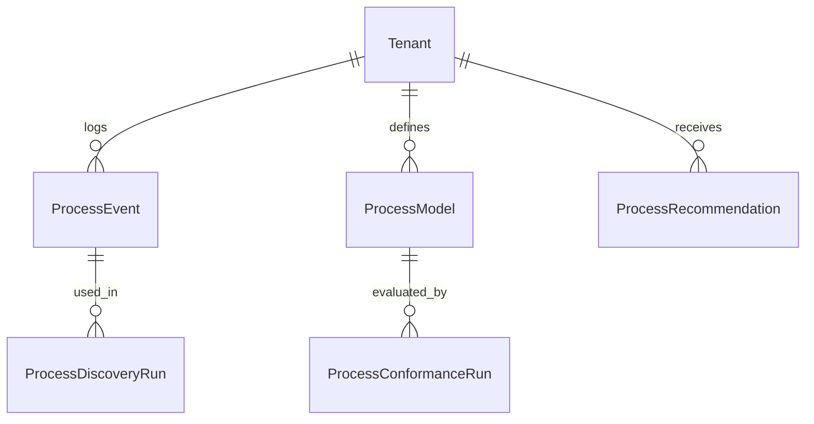

<!-- SPDX-License-Identifier: Apache-2.0 -->
# Process Mining - Comprehensive Design Document

**Version:** 1.0.0
**Last Updated:** 2025-12-02
**Status:** Architecture Design
**Development Agent:** Agent 40

---

## Table of Contents

1. [Executive Summary](#executive-summary)
2. [Market Research & Competitive Analysis](#market-research--competitive-analysis)
3. [Core Features](#core-features)
4. [Resources & Data Model](#resources--data-model)
5. [AI Agents & Automation](#ai-agents--automation)
6. [API Specification](#api-specification)
7. [Security & Permissions](#security--permissions)
8. [Integration Architecture](#integration-architecture)

---

## Executive Summary

### Purpose

The Process Mining module reconstructs and analyzes **real execution flows** from SARAISE event logs (orders, invoices, tickets, workflows, approvals) to show how processes actually run vs. how they were designed. It provides:
- Automated **process discovery** from event logs.
- Conformance checking against reference models (BPMN/flow definitions).
- Bottleneck and variant analysis, plus AI‑assisted explanations and improvement suggestions.

### Business Value Proposition

| Metric                             | Industry Baseline (Celonis, Signavio, Power Automate PM) | SARAISE Target                       | Improvement                    |
|------------------------------------|-----------------------------------------------------------|--------------------------------------|--------------------------------|
| Time to first process map          | 4–8 weeks (data prep, connectors, modeling)              | < 1 week using SARAISE event model   | 75% faster                     |
| Processes instrumented             | 1–3 core processes                                        | ≥ 10 per tenant (out‑of‑the‑box)     | 3–10x coverage                 |
| Cycle time reduction               | 10–20%                                                    | 20–40% on targeted processes         | 2x improvement                 |
| Manual analysis workload           | High (specialist analysts)                               | Dramatically lower via AI narratives | Reduced need for niche skills  |

### Competitive Advantage

| Feature                         | SAP Signavio / SAP Process Insights   | Celonis / Minit / Apromore          | Power Automate Process Mining   | SARAISE Process Mining                                        | Our Advantage                                             |
|---------------------------------|----------------------------------------|-------------------------------------|----------------------------------|----------------------------------------------------------------|-----------------------------------------------------------|
| ERP data integration            | Strong for SAP, weak beyond           | Strong for SAP/Oracle/MS via connectors | Strong in MS stack            | Native over SARAISE’s own modules + consistent event model   | Zero connector tax within SARAISE                        |
| Multi‑tenant SaaS               | Typically per‑enterprise              | Enterprise focus, not multi‑tenant  | Tenant per subscription         | Schema‑per‑tenant with governance baked in                   | Clean SaaS fit                                           |
| AI‑assisted explanation         | Emerging; focused on prebuilt content | Varies; some insights, mostly rule‑based | Early Copilot pieces       | Deep integration with AI Analytics (38) + AI Provider (36)   | Unified AI story across ERP + process mining             |
| Insight‑to‑action               | Often manual handoff to ops           | Some automation, often separate     | Power Automate flows            | Native integration with SARAISE workflows and agents         | Immediate closed‑loop improvement                        |

---

## Market Research & Competitive Analysis

### Industry Overview

Process mining is now mainstream for large enterprises, led by:
- **Celonis**, **SAP Signavio**, **Software AG ARIS**, **UiPath Process Mining**, **Microsoft Power Automate Process Mining**.
They typically:
- Require significant **data engineering** and connector work.
- Produce complex maps and dashboards that still need expert interpretation.
- Focus on a handful of core processes (order‑to‑cash, procure‑to‑pay, record‑to‑report).

For a multi‑tenant ERP like SARAISE, customers want:
- **Reasonable default insights** per module without a system integration project.
- An accessible UX that surfaces the top 3–5 issues and recommended actions per process.
- A direct bridge from insights to **config changes, workflow edits, or automation**.

### Competitor Deep Dive

#### SAP Signavio / Process Insights

**Approach:**
Deep SAP integration; uses SAP event logs to analyze processes and provide best‑practice benchmarks.

**Strengths:**
- Rich SAP‑specific knowledge and best practices.
- Strong visualization of SAP core processes.

**Weaknesses:**
- SAP‑only ecosystem; not oriented to non‑SAP ERPs.
- Implementation requires significant project effort.
- Primarily targeted at large enterprises, not SaaS multi‑tenant models.

#### Celonis / UiPath / Microsoft Process Mining

**Approach:**
Generic process mining engines with connectors to major ERPs and CRMs.

**Strengths:**
- Powerful analysis and visualization capabilities.
- Frameworks for root‑cause analysis and opportunity scoring.

**Weaknesses:**
- Heavyweight implementations; connector and data‑model work is non‑trivial.
- Only loosely tied to ERP application semantics; requires **mapping**.
- Process improvements are executed elsewhere (RPA, config) with limited traceability.

### Market Gaps & SARAISE Opportunities

| Gap                                      | Competitor Weakness                                        | SARAISE Solution                                                                                      |
|------------------------------------------|------------------------------------------------------------|-------------------------------------------------------------------------------------------------------|
| ERP‑aware, SaaS‑native process mining    | Focus on single large enterprises and project‑based setups | Pre‑wired over SARAISE event model; tenants get insights out‑of‑the‑box                              |
| True insight‑to‑action loop              | Insights often live in separate dashboards                 | Integrate with SARAISE workflows so recommended changes can be executed and re‑measured               |
| AI‑level interpretation for non‑experts  | Tools assume process mining expertise                      | LLM‑powered narratives and recommendations over discovered models                                    |

---

## Core Features

### Feature Category 1: Event Log Modeling

#### Feature 1.1: Unified Event Log Schema

**Description:**
Create a canonical `ProcessEvent` model over SARAISE modules (order events, invoice events, ticket events, workflow steps).

**User Story:**
As a **process owner**, I want a single, consistent event log per process so I can analyze flows without custom ETL.

**Acceptance Criteria:**
- [ ] Event adapters for at least Order‑to‑Cash, Procure‑to‑Pay, Incident Management, and Subscription Lifecycle.
- [ ] Events contain `tenant_id`, `case_id`, `activity`, `timestamp`, and relevant attributes.
- [ ] Data is partitioned by tenant and process type for performance and isolation.

### Feature Category 2: Process Discovery & Conformance

#### Feature 2.1: Automatic Process Discovery

**Description:**
Generate process maps from event logs, highlighting the most common paths and variants.

**User Story:**
As a **COO**, I want to see how our actual SAP‑like processes (O2C, P2P) flow in SARAISE and where we deviate from design.

**Acceptance Criteria:**
- [ ] Graph representation of discovered process with frequencies and average durations.
- [ ] Ability to filter by tenant, time window, and segment (e.g., country, product line).

#### Feature 2.2: Conformance Checking

**Description:**
Compare discovered processes against reference models (from SARAISE workflows) and highlight deviations.

**User Story:**
As a **compliance officer**, I want to know when approvals or controls have been skipped.

**Acceptance Criteria:**
- [ ] Import reference models from SARAISE workflow definitions.
- [ ] Flag non‑conforming cases with details on missing or unexpected activities.

### Feature Category 3: Root Cause Analysis & Recommendations

#### Feature 3.1: Bottleneck & Variant Analysis

**Description:**
Quantify bottlenecks (slow steps), variants (unusual flows), and their impact.

**User Story:**
As a **process excellence lead**, I want to know the top 3 bottlenecks and quickest improvement levers across my processes.

**Acceptance Criteria:**
- [ ] Heatmaps of average activity durations and queues.
- [ ] Identification of the top N variants by volume and impact.

#### Feature 3.2: AI‑Generated Improvement Suggestions

**Description:**
Use AI to propose process changes, configuration tweaks, or automation candidates based on observed patterns.

**User Story:**
As a **process owner**, I want concrete, prioritized recommendations with estimated impact and implementation path.

**Acceptance Criteria:**
- [ ] Recommendations link to specific SARAISE modules/workflows.
- [ ] Changes require human approval and are launched as normal SARAISE changes (not auto‑applied).

---

## Resources & Data Model

### Resource Overview

| Resource                 | Purpose                                         | Key Fields (examples)                                      | Relationships                                        |
|-------------------------|-------------------------------------------------|------------------------------------------------------------|-----------------------------------------------------|
| `ProcessEvent`          | Canonical event log entry                      | `tenant_id`, `process_name`, `case_id`, `activity`, `ts`   | Linked to source module entities                    |
| `ProcessModel`          | Reference process definition (logical)         | `name`, `module`, `definition` (BPMN/JSON)                 | Used for conformance checks                         |
| `ProcessDiscoveryRun`   | Metadata for discovery execution               | `tenant_id`, `process_name`, `time_window`, `status`       | Summarizes discovered map                           |
| `ProcessConformanceRun` | Result of conformance analysis                 | `model_id`, `violations`, `coverage`                       | Linked to `ProcessModel` and `ProcessEvent`         |
| `ProcessRecommendation` | Recommended process changes                    | `tenant_id`, `process_name`, `impact_estimate`, `details`  | Linked to workflows/owners                          |

### Example Resource Definition: `ProcessEvent`

```python
{
  "resource_type": "ProcessEvent",
  "module": "process-mining",
  "fields": [
    {"fieldname": "tenant_id", "fieldtype": "Link", "options": "Tenant", "reqd": 1},
    {"fieldname": "process_name", "fieldtype": "Data", "reqd": 1},
    {"fieldname": "case_id", "fieldtype": "Data", "reqd": 1},
    {"fieldname": "activity", "fieldtype": "Data", "reqd": 1},
    {"fieldname": "timestamp", "fieldtype": "Datetime", "reqd": 1},
    {"fieldname": "resource_id", "fieldtype": "Link", "options": "User"},
    {"fieldname": "attributes", "fieldtype": "JSON", "label": "Attributes"},
    {"fieldname": "source_module", "fieldtype": "Data", "label": "Source Module"}
  ],
  "permissions": [
    {"role": "platform_owner", "read": 1},
    {"role": "platform_auditor", "read": 1},
    {"role": "tenant_admin", "read": 1},
    {"role": "tenant_operator", "read": 1}
  ]
}
```

### Entity Relationship Diagram (Logical)



---

## AI Agents & Automation

### Agent 1: Process Discovery Assistant

**Purpose:**
Help users select processes, time windows, and filters, then run discovery jobs and explain the results.

**Trigger:**
- User asks Ask Amani: \"Map our order‑to‑cash process for the last quarter.\"
- Tenant admin configures a new discovery job via UI.

**Actions:**
1. Identify relevant event sources (`ProcessEvent` subsets).
2. Run discovery algorithm and store `ProcessDiscoveryRun`.
3. Generate human‑readable summary of key paths and bottlenecks.

**Governance:**
- Discovery jobs are read‑only; they do not change business data.
- Large jobs can be throttled per tenant to respect quotas.

### Agent 2: Conformance & Improvement Advisor

**Purpose:**
Run conformance checks against reference models and propose targeted improvements.

**Trigger:**
- Scheduled weekly per process, or manual invocation.

**Actions:**
1. Compare discovered paths vs. `ProcessModel`.
2. Identify deviations and quantify their impact.
3. Create `ProcessRecommendation` records with suggested workflow/config changes.

**Governance:**
- Recommendations are suggestions only; execution happens via normal SARAISE change mechanisms.
- All recommendations are linked to underlying metrics and event slices for audit.

### Ask Amani Integration

Example prompts:
- \"Where are we losing the most time in procure‑to‑pay?\"
- \"Which approval steps are most often skipped, and what’s the impact?\"
- \"Simulate the impact of removing this step or automating this approval.\"

Answers are grounded in Process Mining Resources + AI Analytics.

---

## API Specification

Key endpoint groups (prefix `/api/v1/process-mining`):

| Method | Endpoint                      | Description                                       | Auth                    |
|--------|-------------------------------|---------------------------------------------------|-------------------------|
| GET    | `/events`                    | Query `ProcessEvent` logs                         | Admin/operator          |
| POST   | `/discovery/runs`           | Start a discovery run                             | Admin/operator          |
| GET    | `/discovery/runs`           | List discovery runs                               | Admin/operator          |
| GET    | `/discovery/runs/{id}`      | Get run status and results                        | Admin/operator          |
| POST   | `/conformance/runs`         | Start conformance check for a model               | Admin/operator          |
| GET    | `/conformance/runs`         | List conformance runs                             | Admin/operator          |
| GET    | `/recommendations`          | Fetch recommendations for tenant/process          | Admin/operator          |

All endpoints rely on SARAISE's existing Django REST Framework + RBAC stack and must honor tenant isolation at query time.

---

## Security & Permissions

### Role-Based Access Control

| Role                     | View Process Maps | Run Discovery | Run Conformance | View Recommendations |
|--------------------------|-------------------|---------------|-----------------|----------------------|
| `tenant_viewer`          | ✅ (limited)      | ❌            | ❌              | ❌                   |
| `tenant_operator`        | ✅               | ✅            | ✅              | ✅                   |
| `tenant_admin`           | ✅               | ✅            | ✅              | ✅                   |
| `platform_owner`         | ✅ (ops view)    | ✅ (for ops)  | ✅              | ✅                   |
| `platform_auditor`       | ✅ (read‑only)   | ❌            | ❌              | ✅                   |

No process mining query may access another tenant’s events. Platform‑wide aggregate views, if any, must anonymize tenants.

### Data Privacy

- Process logs may include user identifiers and timestamps; these are treated as operational data under SARAISE’s standard controls.
- Optional pseudonymization of users/resources for analytics users who don’t need identity.

### Audit Trail

- Execution of discovery and conformance runs is audited with actor, tenant, process, and time window.
- Any recommendations that lead to workflow/config changes are tied to their originating runs.

---

## Integration Architecture

### Internal Module Integration

| Module                    | Integration Type      | Data Flow                                           | Trigger                             |
|---------------------------|-----------------------|-----------------------------------------------------|-------------------------------------|
| Workflow Engine           | Event emission        | Emits `ProcessEvent` for each workflow step         | Workflow step transitions           |
| Finance / Billing         | Event emission        | Order/invoice creation, approvals, postings         | Business events                     |
| AI Analytics (38)         | Consumption           | Uses process metrics in dashboards and insights     | Analytics jobs                      |
| AI Provider (36)          | Optional              | Backing models for AI narratives and suggestions    | Insight generation                   |

### External System Integration

In future, SARAISE can optionally import events from:
- External ERPs/CRMs via connectors or flat files.
- Workflow/RPA systems for holistic visibility.

### Webhook Events

| Event                            | Payload (excerpt)                            | Use Case                                     |
|----------------------------------|----------------------------------------------|----------------------------------------------|
| `process.discovery.completed`    | `tenant_id`, `process_name`, `run_id`        | Notify ops, update dashboards                |
| `process.conformance.completed`  | `tenant_id`, `process_name`, `run_id`        | Trigger recommendation review                 |

---

**Last Updated:** 2025-12-02
**License:** Apache-2.0
