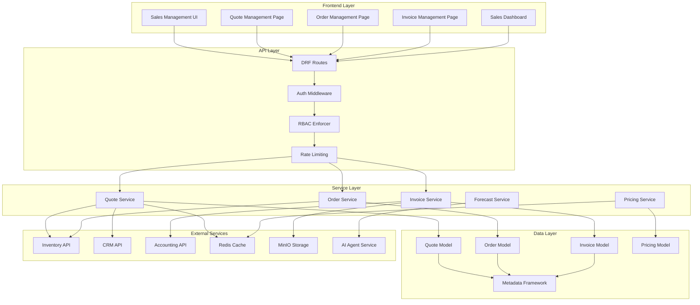
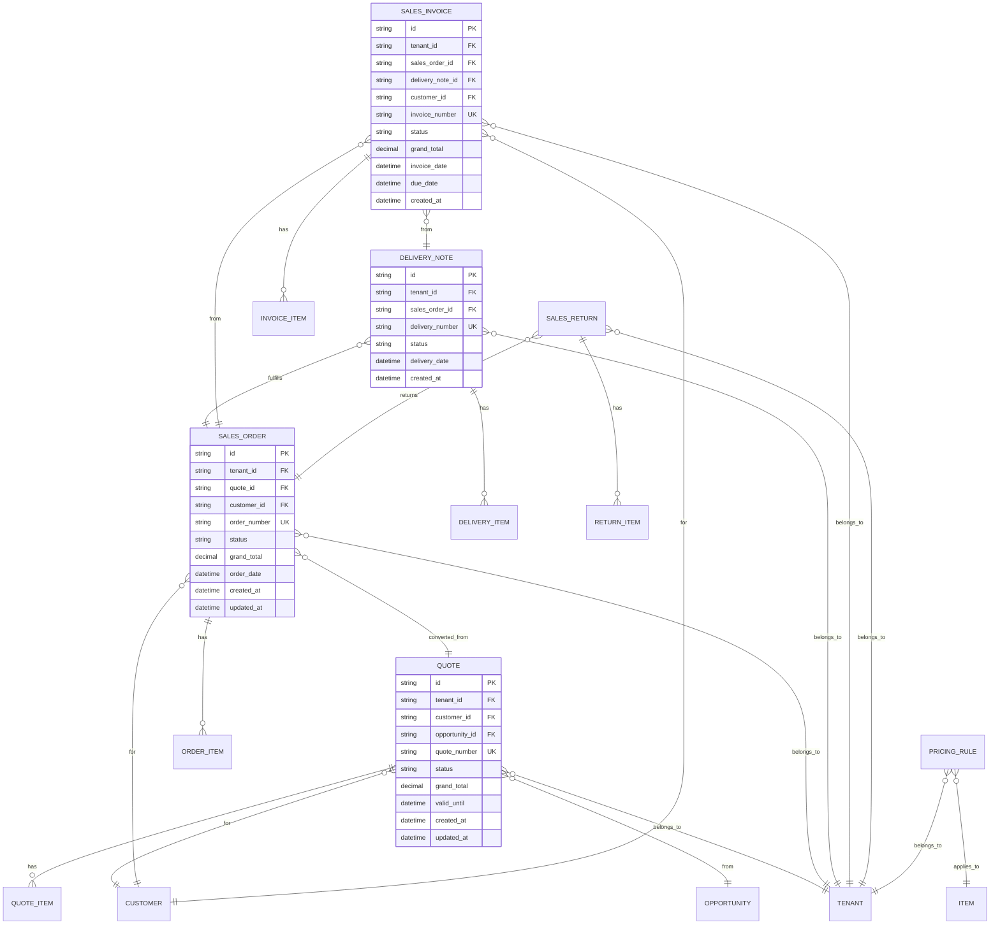
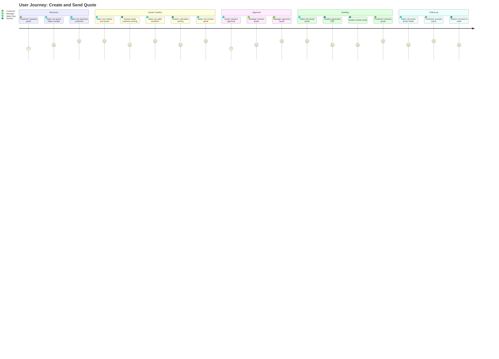
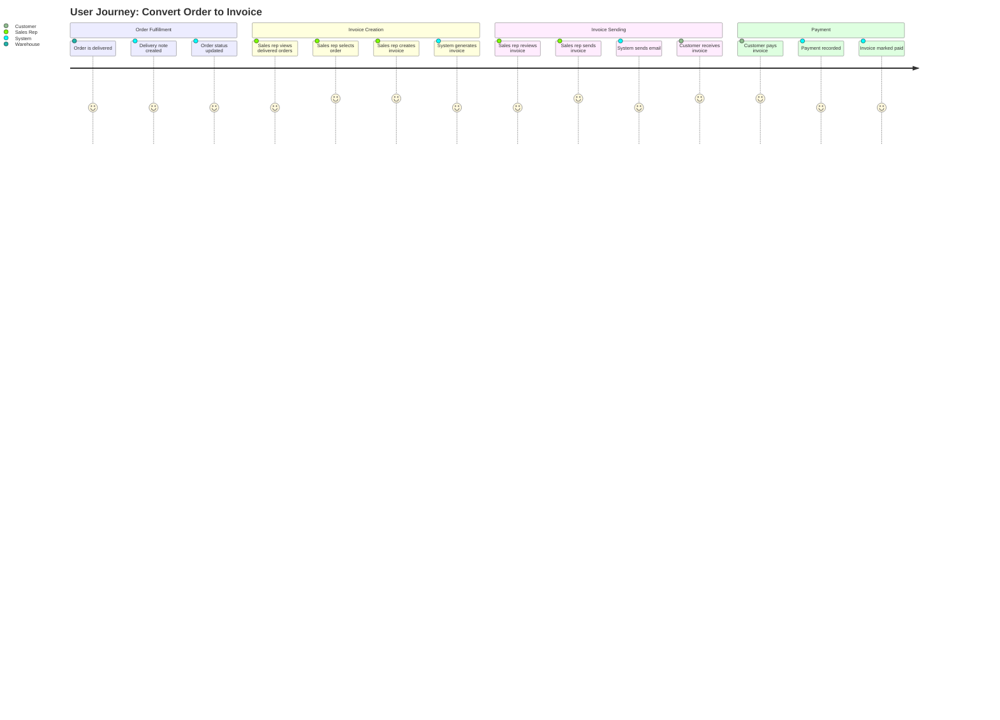

<!-- SPDX-License-Identifier: Apache-2.0 -->
# Sales Management Module - Architecture

**Version:** 1.0.0
**Last Updated:** 2025-12-02
**Status:** Architecture Design
**Merged from:** SALES-MANAGEMENT-DESIGN.md and SALES-MANAGEMENT-DESIGN-PART2.md

---

## Table of Contents

- [1. Module Overview](#1-module-overview)
  - [1.1 Purpose & Value Proposition](#11-purpose--value-proposition)
  - [1.2 User Personas](#12-user-personas)
    - [Persona 1: Sales Manager Sarah](#persona-1-sales-manager-sarah)
    - [Persona 2: Sales Rep Mike](#persona-2-sales-rep-mike)
    - [Persona 3: Finance Director Lisa](#persona-3-finance-director-lisa)
  - [1.3 Jobs-to-Be-Done (JTBD)](#13-jobs-to-be-done-jtbd)
  - [1.4 Measurable Outcomes & KPIs](#14-measurable-outcomes--kpis)
- [2. Market & Competitive Research](#2-market--competitive-research)
  - [2.1 Market Analysis](#21-market-analysis)
  - [2.2 Competitive Benchmarking](#22-competitive-benchmarking)
    - [Feature Comparison Matrix](#feature-comparison-matrix)
    - [UX/UI Analysis](#uxui-analysis)
    - [Technical Analysis](#technical-analysis)
  - [2.3 Differentiation Strategy](#23-differentiation-strategy)
- [3. Architecture & Technical Design](#3-architecture--technical-design)
  - [3.1 Module Architecture Diagram](#31-module-architecture-diagram)
  - [3.2 Folder Structure](#32-folder-structure)
  - [3.3 Database Schema](#33-database-schema)
    - [Entity-Relationship Diagram](#entity-relationship-diagram)
    - [Table Definitions](#table-definitions)
  - [3.4 API Design](#34-api-design)
    - [RESTful Endpoints](#restful-endpoints)
    - [Request/Response Schemas](#requestresponse-schemas)
    - [Error Handling](#error-handling)
  - [3.5 Data Contracts](#35-data-contracts)
    - [Pydantic Schemas](#pydantic-schemas)
  - [3.6 Extension Points](#36-extension-points)
- [4. UX/UI Design](#4-uxui-design)
  - [4.1 User Journey Maps](#41-user-journey-maps)
    - [Primary User Flow: Create and Send Quote](#primary-user-flow-create-and-send-quote)
    - [Secondary User Flow: Convert Order to Invoice](#secondary-user-flow-convert-order-to-invoice)
  - [4.2 Low-Fidelity Wireframes](#42-low-fidelity-wireframes)
    - [Page: Quote Management](#page-quote-management)
    - [Page: Quote Detail/Edit](#page-quote-detailedit)
    - [Page: Sales Dashboard](#page-sales-dashboard)
  - [4.3 High-Fidelity Mockups](#43-high-fidelity-mockups)
  - [4.4 Interaction Models](#44-interaction-models)
  - [4.5 Component Inventory](#45-component-inventory)
    - [Reusable Components (from Design System)](#reusable-components-from-design-system)
    - [Custom Components](#custom-components)
    - [Third-Party Dependencies](#third-party-dependencies)
- [5. Performance & Quality](#5-performance--quality)
  - [5.1 Performance Budgets](#51-performance-budgets)
  - [5.2 Accessibility (WCAG 2.2 AA+)](#52-accessibility-wcag-22-aa)
  - [5.3 Internationalization (i18n)](#53-internationalization-i18n)
- [5. Performance & Quality (Continued)](#5-performance--quality-continued)
  - [5.4 Mobile-First Responsiveness](#54-mobile-first-responsiveness)
- [6. Security & Compliance](#6-security--compliance)
  - [6.1 RBAC Integration](#61-rbac-integration)
  - [6.2 Data Privacy & Compliance](#62-data-privacy--compliance)
  - [6.3 Input Validation & Sanitization](#63-input-validation--sanitization)
  - [6.4 API Security](#64-api-security)
- [7. Testing Strategy](#7-testing-strategy)
  - [7.1 Unit Tests](#71-unit-tests)
  - [7.2 Integration Tests](#72-integration-tests)
  - [7.3 E2E Tests](#73-e2e-tests)
  - [7.4 Performance Tests](#74-performance-tests)
  - [7.5 Accessibility Tests](#75-accessibility-tests)
- [8. Telemetry & Observability](#8-telemetry--observability)
  - [8.1 Metrics Collection](#81-metrics-collection)
  - [8.2 Logging](#82-logging)
  - [8.3 Error Tracking](#83-error-tracking)
  - [8.4 User Analytics](#84-user-analytics)
- [9. Implementation Roadmap](#9-implementation-roadmap)
  - [9.1 Phase 1: Foundation (Weeks 1-2)](#91-phase-1-foundation-weeks-1-2)
  - [9.2 Phase 2: Core Workflows (Weeks 3-4)](#92-phase-2-core-workflows-weeks-3-4)
  - [9.3 Phase 3: Advanced Features (Weeks 5-6)](#93-phase-3-advanced-features-weeks-5-6)
  - [9.4 Phase 4: Polish & Launch (Weeks 7-8)](#94-phase-4-polish--launch-weeks-7-8)
- [10. Deliverables Checklist](#10-deliverables-checklist)
  - [10.1 Documentation](#101-documentation)
  - [10.2 Code](#102-code)
  - [10.3 Quality Assurance](#103-quality-assurance)
  - [10.4 Deployment](#104-deployment)
- [Appendix A: Research References](#appendix-a-research-references)
  - [Competitive Analysis](#competitive-analysis)
  - [Market Research](#market-research)
  - [Design References](#design-references)
- [Appendix B: Glossary](#appendix-b-glossary)

---

**Module:** `sales`
**Location:** `backend/src/modules/sales/`
**Documentation Path:** `docs/modules/02-core-business/SALES-MANAGEMENT.md`
**Dependencies:** `["base", "auth", "metadata", "crm", "inventory"]`
**Estimated Time:** 2 weeks
**Status:** 🟡 Planning

---

## 1. Module Overview

### 1.1 Purpose & Value Proposition

**What problem does this module solve?**

The Sales Management module addresses the critical need for a comprehensive **order-to-cash** workflow that seamlessly manages the entire sales cycle from quotation to delivery, invoicing, and revenue recognition. Current ERP solutions often have fragmented sales processes, poor integration between modules, limited AI capabilities, and complex pricing configurations that slow down sales teams and reduce conversion rates.

**Key Problems Solved:**
- **Fragmented Sales Process:** Disconnected quotation, order, delivery, and invoicing workflows
- **Manual Pricing Errors:** Complex pricing rules lead to human errors and lost revenue
- **Poor Sales Visibility:** Lack of real-time insights into sales performance and pipeline health
- **Inefficient Quote Generation:** Time-consuming manual quote creation delays response times
- **Limited Automation:** Manual follow-ups and approvals create bottlenecks
- **Poor Customer Experience:** Delayed responses and inconsistent pricing damage relationships

**Value Proposition:**
- **Unified Sales Workflow:** Seamless quote-to-cash process in one module
- **AI-Powered Automation:** Intelligent quote generation, pricing optimization, and sales forecasting
- **Real-Time Visibility:** Live dashboards and analytics for data-driven decisions
- **Zero Errors:** Automated calculations and validations prevent pricing mistakes
- **Faster Sales Cycles:** Reduced quote-to-order time by 60% through automation
- **Better Customer Experience:** Instant quotes, accurate pricing, and transparent order tracking

**Target Market:**
- **Primary:** Mid-market B2B companies (50-500 employees) with complex sales processes
- **Secondary:** Growing SMBs (10-50 employees) scaling their sales operations
- **Industries:** Manufacturing, Distribution, Professional Services, Technology

### 1.2 User Personas

#### Persona 1: Sales Manager Sarah
- **Name:** Sarah Chen
- **Role:** Sales Manager
- **Company Size:** Mid-market (150 employees)
- **Industry:** Manufacturing
- **Goals:**
  - Increase team sales by 25% this quarter
  - Reduce quote-to-order cycle time from 5 days to 2 days
  - Improve forecast accuracy to 90%+
  - Identify top-performing products and sales reps
- **Pain Points:**
  - Manual quote approvals delay responses to customers
  - No real-time visibility into team pipeline
  - Inaccurate sales forecasts lead to inventory issues
  - Complex pricing rules cause errors and customer complaints
- **Tech Savviness:** High
- **Usage Frequency:** Daily (4-6 hours/day)

#### Persona 2: Sales Rep Mike
- **Name:** Mike Rodriguez
- **Role:** Sales Representative
- **Company Size:** Mid-market (150 employees)
- **Industry:** Distribution
- **Goals:**
  - Close 20% more deals this quarter
  - Respond to customer quotes within 2 hours
  - Reduce time spent on administrative tasks
  - Access customer history and pricing instantly
- **Pain Points:**
  - Creating quotes manually takes 30+ minutes
  - Don't know if inventory is available when quoting
  - Pricing errors require re-quotes and damage relationships
  - Can't track quote status or customer engagement
- **Tech Savviness:** Medium
- **Usage Frequency:** Daily (6-8 hours/day)

#### Persona 3: Finance Director Lisa
- **Name:** Lisa Thompson
- **Role:** Finance Director
- **Company Size:** Mid-market (150 employees)
- **Industry:** Professional Services
- **Goals:**
  - Ensure accurate revenue recognition
  - Track outstanding receivables
  - Validate pricing compliance
  - Generate accurate financial reports
- **Pain Points:**
  - Manual invoice creation is error-prone
  - Revenue recognition is delayed
  - Pricing overrides lack proper approval trails
  - Integration with accounting system is manual
- **Tech Savviness:** Medium
- **Usage Frequency:** Weekly (2-3 hours/week)

### 1.3 Jobs-to-Be-Done (JTBD)

**Primary Jobs:**

1. **Create and Send Professional Quote**
   - **When:** Customer requests pricing for products/services
   - **I want to:** Generate accurate, professional quotes quickly
   - **So I can:** Respond faster than competitors and win more deals
   - **Success Metrics:**
     - Quote creation time < 5 minutes
     - Quote accuracy 100%
     - Quote-to-order conversion rate > 30%

2. **Convert Quote to Sales Order**
   - **When:** Customer accepts quote
   - **I want to:** Convert quote to order with one click
   - **So I can:** Process orders immediately and reduce errors
   - **Success Metrics:**
     - Conversion time < 2 minutes
     - Zero data entry errors
     - Order accuracy 100%

3. **Track Order Fulfillment**
   - **When:** Order is placed
   - **I want to:** See real-time order status and delivery tracking
   - **So I can:** Keep customers informed and reduce support calls
   - **Success Metrics:**
     - Customer satisfaction > 90%
     - Support ticket reduction 50%
     - On-time delivery rate > 95%

4. **Generate Invoice and Collect Payment**
   - **When:** Order is delivered
   - **I want to:** Automatically generate invoices and process payments
   - **So I can:** Improve cash flow and reduce DSO (Days Sales Outstanding)
   - **Success Metrics:**
     - Invoice generation time < 1 minute
     - DSO reduction 20%
     - Payment collection rate > 95%

5. **Analyze Sales Performance**
   - **When:** Reviewing sales performance
   - **I want to:** See real-time sales metrics and forecasts
   - **So I can:** Make data-driven decisions and optimize sales strategy
   - **Success Metrics:**
     - Forecast accuracy > 90%
     - Time to insights < 5 minutes
     - Actionable recommendations provided

**Secondary Jobs:**
- Manage customer pricing agreements
- Handle sales returns and refunds
- Configure complex products (CPQ)
- Approve pricing overrides
- Manage sales territories and quotas

### 1.4 Measurable Outcomes & KPIs

**Business Metrics:**
- **Sales Revenue Growth:** Increase by 25% in first year
- **Quote-to-Order Conversion:** Improve from 20% to 35%
- **Sales Cycle Time:** Reduce from 30 days to 18 days
- **Order Accuracy:** Achieve 99.9% accuracy (zero pricing errors)
- **Customer Satisfaction:** Maintain > 90% satisfaction score
- **DSO (Days Sales Outstanding):** Reduce by 20%

**User Experience Metrics:**
- **Quote Creation Time:** < 5 minutes (from 30 minutes)
- **Task Completion Rate:** > 95% for all primary jobs
- **User Satisfaction:** > 4.5/5.0 rating
- **Training Time:** < 2 hours for new users
- **Error Rate:** < 0.1% (from 5%)

**Technical Metrics:**
- **API Response Time:** < 200ms (95th percentile)
- **Page Load Time:** < 2.5s (LCP)
- **Database Query Time:** < 100ms (95th percentile)
- **System Uptime:** > 99.9%
- **Concurrent Users:** Support 100+ simultaneous users

---

## 2. Market & Competitive Research

### 2.1 Market Analysis

**Market Size:**
- **Global ERP Market:** $50.6B (2023), growing at 10.2% CAGR
- **Sales Management Software Market:** $8.2B (2023), growing at 12.5% CAGR
- **Target Addressable Market (TAM):** $2.1B (mid-market segment)
- **Serviceable Addressable Market (SAM):** $420M (B2B focus)
- **Serviceable Obtainable Market (SOM):** $42M (1% market share target)

**Market Segments:**
- **SMB (10-50 employees):** 45% of market, price-sensitive
- **Mid-Market (50-500 employees):** 35% of market, feature-rich needs
- **Enterprise (500+ employees):** 20% of market, complex requirements

**Growth Trends:**
- **AI Integration:** 78% of companies want AI-powered sales tools
- **Cloud Adoption:** 85% prefer cloud-based solutions
- **Mobile Access:** 72% need mobile sales capabilities
- **Integration Requirements:** 90% need integration with existing systems

**User Pain Points (from market research):**
- **Complex Pricing (78%):** Difficult to configure and maintain pricing rules
- **Poor Integration (65%):** Fragmented systems require manual data entry
- **Limited Automation (72%):** Too many manual processes slow down sales
- **Poor Visibility (68%):** Lack of real-time insights into sales performance
- **Mobile Limitations (55%):** Limited mobile functionality for field sales

### 2.2 Competitive Benchmarking

#### Feature Comparison Matrix

| Feature | SAP S/4HANA Sales | Oracle NetSuite | Microsoft D365 Sales | Odoo Sales | SARAISE (Target) |
|---------|-------------------|-----------------|----------------------|------------|-------------------|
| **Quote Management** | ✅ Advanced | ✅ Advanced | ✅ Standard | ✅ Basic | ✅ Advanced + AI |
| **CPQ (Configure, Price, Quote)** | ✅ Enterprise | ✅ Add-on | ✅ Add-on | ❌ | ✅ Native + AI |
| **Order Management** | ✅ Advanced | ✅ Advanced | ✅ Standard | ✅ Basic | ✅ Advanced |
| **Multi-Warehouse** | ✅ | ✅ | ✅ | ✅ | ✅ |
| **Pricing Rules Engine** | ✅ Complex | ✅ Standard | ✅ Basic | ✅ Basic | ✅ Advanced + AI |
| **Sales Forecasting** | ✅ Advanced | ✅ Standard | ✅ Standard | ✅ Basic | ✅ AI-Powered |
| **Mobile App** | ✅ | ✅ | ✅ | ✅ Limited | ✅ Full-Featured |
| **AI Integration** | ✅ Limited | ✅ Limited | ✅ Limited | ❌ | ✅ Native |
| **Workflow Automation** | ✅ | ✅ | ✅ | ✅ Basic | ✅ Advanced |
| **Real-Time Analytics** | ✅ | ✅ | ✅ | ✅ Basic | ✅ Advanced |
| **API-First Architecture** | ❌ | ✅ | ✅ | ✅ | ✅ |
| **Modular Architecture** | ❌ | ❌ | ❌ | ✅ | ✅ |
| **Metadata Customization** | ❌ | ❌ | ❌ | ❌ | ✅ |
| **Price:** | $150-300/user/mo | $99-199/user/mo | $65-95/user/mo | $24/user/mo | $49-149/user/mo |

#### UX/UI Analysis

**SAP S/4HANA Sales:**
- **Strengths:**
  - Comprehensive feature set
  - Strong enterprise capabilities
  - Robust reporting
- **Weaknesses:**
  - Complex, cluttered interface
  - Steep learning curve
  - Poor mobile experience
  - Legacy UI patterns
- **Design Patterns:**
  - Traditional enterprise UI
  - Complex navigation
  - Information-dense screens

**Oracle NetSuite:**
- **Strengths:**
  - Unified platform
  - Good reporting
  - Strong integration
- **Weaknesses:**
  - Dated interface
  - Limited customization
  - Complex setup
- **Design Patterns:**
  - Tab-based navigation
  - Form-heavy interface
  - Limited visual design

**Microsoft Dynamics 365 Sales:**
- **Strengths:**
  - Modern UI
  - Good mobile app
  - Office 365 integration
- **Weaknesses:**
  - Limited CPQ capabilities
  - Complex licensing
  - Limited customization
- **Design Patterns:**
  - Modern Microsoft Fluent UI
  - Card-based layouts
  - Responsive design

**Odoo Sales:**
- **Strengths:**
  - Open source
  - Modular architecture
  - Affordable pricing
- **Weaknesses:**
  - Basic features
  - Limited AI capabilities
  - Inconsistent UI
- **Design Patterns:**
  - Simple forms
  - List views
  - Basic dashboards

#### Technical Analysis

**Architecture Patterns:**
- **SAP/Oracle:** Monolithic, legacy architecture
- **Microsoft:** Cloud-native, microservices
- **Odoo:** Modular but tightly coupled
- **SARAISE:** True modular, metadata-driven, API-first

**API Design:**
- **SAP:** Complex SOAP APIs, limited REST
- **Oracle:** REST APIs, but complex
- **Microsoft:** Modern REST APIs, Graph API
- **Odoo:** REST APIs, but limited
- **SARAISE:** RESTful APIs, OpenAPI documentation, webhooks

**Performance:**
- **SAP:** Slow (legacy architecture)
- **Oracle:** Moderate (cloud helps)
- **Microsoft:** Good (cloud-native)
- **Odoo:** Variable (depends on hosting)
- **SARAISE Target:** < 200ms API response, < 2.5s page load

### 2.3 Differentiation Strategy

**Unique Value Propositions:**

1. **AI-Native Sales Automation**
   - **What:** Native AI agents for quote generation, pricing optimization, and sales forecasting
   - **Why Better:** Not bolted-on AI, but built-in intelligence that learns and adapts
   - **Competitive Edge:** Only ERP with native AI agent management for sales

2. **True Modular Architecture**
   - **What:** Per-tenant module installation, lazy loading, subscription-based access
   - **Why Better:** Pay only for what you use, faster performance, easier customization
   - **Competitive Edge:** Only ERP with true module isolation and lazy loading

3. **Metadata-Driven Customization**
   - **What:** Customize sales processes without code changes
   - **Why Better:** Business users can customize, not just developers
   - **Competitive Edge:** Dynamic customization framework unique to SARAISE

4. **Unified Quote-to-Cash Workflow**
   - **What:** Seamless integration between quote, order, delivery, and invoice
   - **Why Better:** Zero data re-entry, real-time synchronization
   - **Competitive Edge:** Best-in-class workflow automation

5. **Modern Developer Experience**
   - **What:** Django REST Framework, React, TypeScript, OpenAPI documentation
   - **Why Better:** Easier to integrate, customize, and extend
   - **Competitive Edge:** Modern tech stack with battle-tested frameworks

**Innovation Opportunities:**
- **AI-Powered Pricing:** Dynamic pricing based on demand, inventory, and customer value
- **Predictive Sales Forecasting:** Machine learning models for accurate forecasts
- **Automated Quote Generation:** AI agents create quotes from customer requirements
- **Intelligent Order Routing:** AI determines best warehouse and shipping method
- **Customer Success Automation:** AI agents handle post-sale engagement

**Gap Analysis:**
- **Feature Gaps:** Limited AI capabilities, poor mobile experience, complex pricing
- **Our Solution:** Native AI integration, mobile-first design, intuitive pricing engine
- **Market Opportunity:** $420M addressable market with 1% share target ($4.2M ARR)

---

## 3. Architecture & Technical Design

### 3.1 Module Architecture Diagram



### 3.2 Folder Structure

**Authoritative Structure** (per SARAISE-26001, SARAISE-27002):

```
backend/src/modules/sales/
├── __init__.py              # Module manifest
├── models.py                # Django ORM models (Quote, Order, Invoice, etc.)
├── schemas.py               # Pydantic schemas (QuoteCreate, OrderResponse, etc.)
├── routes.py                # DRF routes
├── services.py              # Business logic (QuoteService, OrderService, etc.)
├── dependencies.py          # Module dependencies
├── permissions.py          # Module-specific permissions
├── migrations/              # Django migrations
│   ├── versions/
│   │   └── 001_initial_schema.py
│   └── env.py
├── tests/                   # 90%+ coverage
│   ├── conftest.py
│   ├── test_models.py
│   ├── test_services.py
│   ├── test_routes.py
│   └── test_integration.py
└── README.md                # Usage documentation
```

### 3.3 Database Schema

#### Entity-Relationship Diagram



#### Table Definitions

**Table: `quotes`**
- **Purpose:** Store sales quotations sent to customers
- **Columns:**
  - `id` (UUID, PK): Unique identifier
  - `tenant_id` (UUID, FK → tenants.id): Tenant isolation
  - `customer_id` (UUID, FK → customers.id): Customer reference
  - `opportunity_id` (UUID, FK → opportunities.id, nullable): Source opportunity
  - `quote_number` (String, unique): Auto-generated quote number (e.g., "QT-2025-001")
  - `status` (Enum): draft, sent, accepted, rejected, expired, converted
  - `valid_until` (DateTime): Quote expiration date
  - `grand_total` (Decimal): Total quote amount
  - `currency` (String): Currency code (default: USD)
  - `payment_terms` (String): Payment terms (Net 30, COD, etc.)
  - `delivery_terms` (String): Delivery terms (FOB, CIF, etc.)
  - `notes` (Text, nullable): Internal notes
  - `customer_notes` (Text, nullable): Notes visible to customer
  - `created_by` (UUID, FK → users.id): Creator
  - `created_at` (DateTime): Creation timestamp
  - `updated_at` (DateTime): Last update timestamp
- **Indexes:**
  - `idx_quotes_tenant_id`: Tenant isolation
  - `idx_quotes_customer_id`: Customer lookup
  - `idx_quotes_status`: Status filtering
  - `idx_quotes_quote_number`: Quote number lookup
  - `idx_quotes_created_at`: Date range queries
- **Constraints:**
  - `uq_quotes_quote_number`: Unique quote number per tenant
  - `fk_quotes_tenant`: Foreign key to tenants
  - `fk_quotes_customer`: Foreign key to customers

**Table: `quote_items`**
- **Purpose:** Store line items in quotations
- **Columns:**
  - `id` (UUID, PK): Unique identifier
  - `quote_id` (UUID, FK → quotes.id): Parent quote
  - `item_id` (UUID, FK → items.id): Product/service reference
  - `item_code` (String): Item SKU/code
  - `item_name` (String): Item name
  - `description` (Text, nullable): Item description
  - `quantity` (Decimal): Quantity ordered
  - `unit_price` (Decimal): Unit price
  - `discount_percent` (Decimal, default=0): Discount percentage
  - `discount_amount` (Decimal, default=0): Discount amount
  - `tax_rate` (Decimal, default=0): Tax rate
  - `tax_amount` (Decimal, default=0): Tax amount
  - `line_total` (Decimal): Line total (quantity × unit_price - discount + tax)
  - `warehouse_id` (UUID, FK → warehouses.id, nullable): Warehouse for fulfillment
  - `delivery_date` (DateTime, nullable): Expected delivery date
  - `created_at` (DateTime): Creation timestamp
- **Indexes:**
  - `idx_quote_items_quote_id`: Quote lookup
  - `idx_quote_items_item_id`: Item lookup
- **Constraints:**
  - `fk_quote_items_quote`: Foreign key to quotes
  - `fk_quote_items_item`: Foreign key to items

**Table: `sales_orders`**
- **Purpose:** Store confirmed sales orders
- **Columns:**
  - `id` (UUID, PK): Unique identifier
  - `tenant_id` (UUID, FK → tenants.id): Tenant isolation
  - `quote_id` (UUID, FK → quotes.id, nullable): Source quote
  - `customer_id` (UUID, FK → customers.id): Customer reference
  - `order_number` (String, unique): Auto-generated order number (e.g., "SO-2025-001")
  - `status` (Enum): draft, confirmed, in_progress, shipped, delivered, cancelled
  - `order_date` (DateTime): Order date
  - `delivery_date` (DateTime, nullable): Expected delivery date
  - `grand_total` (Decimal): Total order amount
  - `currency` (String): Currency code
  - `payment_terms` (String): Payment terms
  - `shipping_address` (JSON): Shipping address
  - `billing_address` (JSON): Billing address
  - `shipping_method` (String, nullable): Shipping method
  - `tracking_number` (String, nullable): Shipping tracking number
  - `notes` (Text, nullable): Internal notes
  - `created_by` (UUID, FK → users.id): Creator
  - `created_at` (DateTime): Creation timestamp
  - `updated_at` (DateTime): Last update timestamp
- **Indexes:**
  - `idx_sales_orders_tenant_id`: Tenant isolation
  - `idx_sales_orders_customer_id`: Customer lookup
  - `idx_sales_orders_status`: Status filtering
  - `idx_sales_orders_order_date`: Date range queries
- **Constraints:**
  - `uq_sales_orders_order_number`: Unique order number per tenant
  - `fk_sales_orders_tenant`: Foreign key to tenants

**Table: `sales_invoices`**
- **Purpose:** Store sales invoices for delivered orders
- **Columns:**
  - `id` (UUID, PK): Unique identifier
  - `tenant_id` (UUID, FK → tenants.id): Tenant isolation
  - `sales_order_id` (UUID, FK → sales_orders.id, nullable): Source order
  - `delivery_note_id` (UUID, FK → delivery_notes.id, nullable): Source delivery
  - `customer_id` (UUID, FK → customers.id): Customer reference
  - `invoice_number` (String, unique): Auto-generated invoice number (e.g., "SI-2025-001")
  - `status` (Enum): draft, submitted, paid, overdue, cancelled
  - `invoice_date` (DateTime): Invoice date
  - `due_date` (DateTime): Payment due date
  - `grand_total` (Decimal): Total invoice amount
  - `paid_amount` (Decimal, default=0): Amount paid
  - `outstanding_amount` (Decimal): Outstanding amount (grand_total - paid_amount)
  - `currency` (String): Currency code
  - `payment_terms` (String): Payment terms
  - `billing_address` (JSON): Billing address
  - `notes` (Text, nullable): Internal notes
  - `created_by` (UUID, FK → users.id): Creator
  - `created_at` (DateTime): Creation timestamp
  - `updated_at` (DateTime): Last update timestamp
- **Indexes:**
  - `idx_sales_invoices_tenant_id`: Tenant isolation
  - `idx_sales_invoices_customer_id`: Customer lookup
  - `idx_sales_invoices_status`: Status filtering
  - `idx_sales_invoices_due_date`: Overdue tracking
- **Constraints:**
  - `uq_sales_invoices_invoice_number`: Unique invoice number per tenant
  - `fk_sales_invoices_tenant`: Foreign key to tenants

**Table: `pricing_rules`**
- **Purpose:** Store pricing rules for dynamic pricing
- **Columns:**
  - `id` (UUID, PK): Unique identifier
  - `tenant_id` (UUID, FK → tenants.id): Tenant isolation
  - `name` (String): Rule name
  - `rule_type` (Enum): customer, item, quantity, date_range, promotion
  - `priority` (Integer): Rule priority (higher = applied first)
  - `conditions` (JSON): Rule conditions (e.g., customer group, item category)
  - `discount_type` (Enum): percentage, fixed_amount, price_override
  - `discount_value` (Decimal): Discount value
  - `valid_from` (DateTime): Rule start date
  - `valid_until` (DateTime, nullable): Rule end date
  - `is_active` (Boolean, default=True): Active status
  - `created_at` (DateTime): Creation timestamp
  - `updated_at` (DateTime): Last update timestamp
- **Indexes:**
  - `idx_pricing_rules_tenant_id`: Tenant isolation
  - `idx_pricing_rules_rule_type`: Rule type filtering
  - `idx_pricing_rules_priority`: Priority sorting
- **Constraints:**
  - `fk_pricing_rules_tenant`: Foreign key to tenants

### 3.4 API Design

#### RESTful Endpoints

**Base Path:** `/api/v1/sales`

| Method | Endpoint | Description | Auth Required | RBAC Role |
|--------|----------|-------------|---------------|-----------|
| GET | `/quotes` | List quotes | ✅ | `tenant_user` |
| GET | `/quotes/{id}` | Get quote | ✅ | `tenant_user` |
| POST | `/quotes` | Create quote | ✅ | `tenant_user` |
| PUT | `/quotes/{id}` | Update quote | ✅ | `tenant_user` |
| DELETE | `/quotes/{id}` | Delete quote | ✅ | `tenant_admin` |
| POST | `/quotes/{id}/send` | Send quote to customer | ✅ | `tenant_user` |
| POST | `/quotes/{id}/accept` | Accept quote | ✅ | `tenant_user` |
| POST | `/quotes/{id}/convert` | Convert quote to order | ✅ | `tenant_user` |
| GET | `/orders` | List sales orders | ✅ | `tenant_user` |
| GET | `/orders/{id}` | Get sales order | ✅ | `tenant_user` |
| POST | `/orders` | Create sales order | ✅ | `tenant_user` |
| PUT | `/orders/{id}` | Update sales order | ✅ | `tenant_user` |
| POST | `/orders/{id}/confirm` | Confirm order | ✅ | `tenant_user` |
| POST | `/orders/{id}/cancel` | Cancel order | ✅ | `tenant_admin` |
| GET | `/invoices` | List sales invoices | ✅ | `tenant_user` |
| GET | `/invoices/{id}` | Get sales invoice | ✅ | `tenant_user` |
| POST | `/invoices` | Create sales invoice | ✅ | `tenant_user` |
| POST | `/invoices/{id}/send` | Send invoice to customer | ✅ | `tenant_user` |
| POST | `/invoices/{id}/mark-paid` | Mark invoice as paid | ✅ | `tenant_user` |
| GET | `/pricing/calculate` | Calculate price with rules | ✅ | `tenant_user` |
| GET | `/analytics/dashboard` | Get sales dashboard data | ✅ | `tenant_user` |
| GET | `/analytics/forecast` | Get sales forecast | ✅ | `tenant_user` |

#### Request/Response Schemas

**Create Quote Request:**
```python
class QuoteCreate(BaseModel):
    customer_id: str = Field(..., description="Customer ID")
    opportunity_id: Optional[str] = Field(None, description="Source opportunity ID")
    valid_until: datetime = Field(..., description="Quote expiration date")
    payment_terms: str = Field(default="Net 30", description="Payment terms")
    delivery_terms: Optional[str] = Field(None, description="Delivery terms")
    items: List[QuoteItemCreate] = Field(..., min_items=1, description="Quote items")
    notes: Optional[str] = Field(None, max_length=1000, description="Internal notes")
    customer_notes: Optional[str] = Field(None, max_length=1000, description="Customer-visible notes")

    class Config:
        json_schema_extra = {
            "example": {
                "customer_id": "customer-123",
                "opportunity_id": "opp-456",
                "valid_until": "2025-02-01T00:00:00Z",
                "payment_terms": "Net 30",
                "items": [
                    {
                        "item_id": "item-789",
                        "quantity": 10,
                        "unit_price": 100.00
                    }
                ]
            }
        }

class QuoteItemCreate(BaseModel):
    item_id: str = Field(..., description="Item ID")
    quantity: Decimal = Field(..., gt=0, description="Quantity")
    unit_price: Decimal = Field(..., gt=0, description="Unit price")
    discount_percent: Optional[Decimal] = Field(0, ge=0, le=100, description="Discount percentage")
    warehouse_id: Optional[str] = Field(None, description="Warehouse for fulfillment")
    delivery_date: Optional[datetime] = Field(None, description="Expected delivery date")
```

**Quote Response:**
```python
class QuoteResponse(BaseModel):
    id: str
    tenant_id: str
    customer_id: str
    opportunity_id: Optional[str]
    quote_number: str
    status: Literal["draft", "sent", "accepted", "rejected", "expired", "converted"]
    valid_until: datetime
    grand_total: Decimal
    currency: str
    payment_terms: str
    delivery_terms: Optional[str]
    items: List[QuoteItemResponse]
    notes: Optional[str]
    customer_notes: Optional[str]
    created_by: str
    created_at: datetime
    updated_at: datetime

    class Config:
        from_attributes = True

class QuoteItemResponse(BaseModel):
    id: str
    quote_id: str
    item_id: str
    item_code: str
    item_name: str
    description: Optional[str]
    quantity: Decimal
    unit_price: Decimal
    discount_percent: Decimal
    discount_amount: Decimal
    tax_rate: Decimal
    tax_amount: Decimal
    line_total: Decimal
    warehouse_id: Optional[str]
    delivery_date: Optional[datetime]

    class Config:
        from_attributes = True
```

**List Response (Paginated):**
```python
class QuoteListResponse(BaseModel):
    items: List[QuoteResponse]
    total: int
    page: int
    page_size: int
    total_pages: int
```

#### Error Handling

**Standard Error Response:**
```python
class ErrorResponse(BaseModel):
    error: ErrorDetail

class ErrorDetail(BaseModel):
    code: str  # e.g., "VALIDATION_ERROR", "NOT_FOUND", "INSUFFICIENT_STOCK"
    message: str
    details: Optional[Dict[str, Any]] = None
    timestamp: datetime
```

**Error Codes:**
- `VALIDATION_ERROR` (400): Input validation failed
- `NOT_FOUND` (404): Resource not found
- `UNAUTHORIZED` (401): Authentication required
- `FORBIDDEN` (403): Insufficient permissions
- `INSUFFICIENT_STOCK` (409): Insufficient inventory for order
- `QUOTE_EXPIRED` (400): Quote has expired
- `INVALID_STATUS_TRANSITION` (400): Invalid status change
- `PRICING_ERROR` (500): Pricing calculation error
- `CONFLICT` (409): Resource conflict
- `INTERNAL_ERROR` (500): Server error

### 3.5 Data Contracts

#### Pydantic Schemas

**Core Schemas:**
- `QuoteCreate`: Quote creation input
- `QuoteUpdate`: Quote update input (partial)
- `QuoteResponse`: Quote API response
- `QuoteListResponse`: Paginated quote list
- `OrderCreate`: Order creation input
- `OrderResponse`: Order API response
- `InvoiceCreate`: Invoice creation input
- `InvoiceResponse`: Invoice API response
- `PricingCalculateRequest`: Price calculation input
- `PricingCalculateResponse`: Price calculation result

**Validation Rules:**
- Quote items: Minimum 1 item required
- Quantities: Must be > 0
- Prices: Must be >= 0
- Discounts: Must be 0-100% for percentage, >= 0 for fixed amount
- Dates: Valid until must be in the future
- Status transitions: Only valid transitions allowed

**Type Definitions:**
```python
from typing import Literal

QuoteStatus = Literal["draft", "sent", "accepted", "rejected", "expired", "converted"]
OrderStatus = Literal["draft", "confirmed", "in_progress", "shipped", "delivered", "cancelled"]
InvoiceStatus = Literal["draft", "submitted", "paid", "overdue", "cancelled"]
PricingRuleType = Literal["customer", "item", "quantity", "date_range", "promotion"]
DiscountType = Literal["percentage", "fixed_amount", "price_override"]
```

### 3.6 Extension Points

**Customization Hooks:**
- `before_quote_create`: Pre-create hook (validate, modify data)
- `after_quote_create`: Post-create hook (notifications, logging)
- `before_quote_send`: Pre-send hook (final validation)
- `after_quote_send`: Post-send hook (tracking, analytics)
- `before_quote_convert`: Pre-convert hook (validate conversion)
- `after_quote_convert`: Post-convert hook (order creation)
- `before_order_confirm`: Pre-confirm hook (stock check, validation)
- `after_order_confirm`: Post-confirm hook (notifications, inventory reservation)
- `before_invoice_create`: Pre-create hook (validation)
- `after_invoice_create`: Post-create hook (accounting integration)

**Plugin Architecture:**
- **Pricing Engine Plugin:** Custom pricing calculation logic
- **Tax Calculation Plugin:** Custom tax calculation rules
- **Shipping Integration Plugin:** Custom shipping carrier integration
- **Payment Gateway Plugin:** Custom payment processing

**Webhook Endpoints:**
- `POST /webhooks/sales/quote_created`: Quote created event
- `POST /webhooks/sales/quote_sent`: Quote sent event
- `POST /webhooks/sales/quote_accepted`: Quote accepted event
- `POST /webhooks/sales/order_created`: Order created event
- `POST /webhooks/sales/order_confirmed`: Order confirmed event
- `POST /webhooks/sales/invoice_created`: Invoice created event
- `POST /webhooks/sales/invoice_paid`: Invoice paid event

---

## 4. UX/UI Design

### 4.1 User Journey Maps

#### Primary User Flow: Create and Send Quote



**Steps:**

1. **Customer Requests Quote:**
   - **User Action:** Customer contacts sales rep via email/phone/CRM
   - **System Response:** Create opportunity in CRM, link to quote
   - **Success Criteria:** Opportunity created, quote can be linked

2. **Sales Rep Creates Quote:**
   - **User Action:** Click "New Quote" button, select customer
   - **System Response:** Load customer data, pricing rules, product catalog
   - **Success Criteria:** Quote form loaded with customer info in < 2s

3. **Add Products to Quote:**
   - **User Action:** Search/browse products, add to quote
   - **System Response:** Auto-calculate pricing, apply discounts, check inventory
   - **Success Criteria:** Products added, pricing calculated correctly

4. **Review and Adjust Quote:**
   - **User Action:** Review line items, adjust quantities/prices if needed
   - **System Response:** Recalculate totals, show warnings for overrides
   - **Success Criteria:** Quote totals accurate, warnings shown for overrides

5. **Approve Quote (if needed):**
   - **User Action:** Submit for approval if amount exceeds threshold
   - **System Response:** Route to approver, send notification
   - **Success Criteria:** Approval workflow triggered, notification sent

6. **Send Quote to Customer:**
   - **User Action:** Click "Send Quote" button
   - **System Response:** Generate PDF, send email, update status
   - **Success Criteria:** Quote sent, customer receives email, status updated

7. **Track Quote Status:**
   - **User Action:** View quote in dashboard, check customer engagement
   - **System Response:** Show quote status, email opens, link clicks
   - **Success Criteria:** Real-time status updates, engagement metrics visible

8. **Convert Quote to Order:**
   - **User Action:** Customer accepts quote, sales rep converts to order
   - **System Response:** Create order, reserve inventory, send confirmation
   - **Success Criteria:** Order created, inventory reserved, confirmation sent

**Edge Cases:**
- **Customer not found:** Show "Create Customer" option
- **Product out of stock:** Show alternative products or backorder option
- **Pricing override required:** Show approval workflow
- **Quote expired:** Show "Renew Quote" option
- **Multiple quote versions:** Show version history

**Error Scenarios:**
- **Network error:** Retry with exponential backoff
- **Validation error:** Show inline error messages
- **Permission denied:** Show "Request Access" option
- **System error:** Show friendly error message, log for support

#### Secondary User Flow: Convert Order to Invoice



### 4.2 Low-Fidelity Wireframes

#### Page: Quote Management

**Layout Structure:**
```
┌─────────────────────────────────────────────────────────┐
│ Header (Navigation, User Menu, Notifications)           │
├─────────────────────────────────────────────────────────┤
│ Breadcrumbs: Sales > Quotes                             │
├─────────────────────────────────────────────────────────┤
│                                                          │
│  [New Quote] [Import] [Export] [Filters ▼] [Search]    │
│                                                          │
│  ┌──────────────────────────────────────────────────┐  │
│  │ Quotes Table                                      │  │
│  │ ┌──────┬──────────┬──────────┬──────────┬─────┐ │  │
│  │ │ #    │ Customer │ Amount   │ Status   │ ... │ │  │
│  │ ├──────┼──────────┼──────────┼──────────┼─────┤ │  │
│  │ │ QT-1 │ Acme Co  │ $10,000  │ Sent     │ ... │ │  │
│  │ │ QT-2 │ Beta Inc │ $5,000   │ Accepted │ ... │ │  │
│  │ └──────┴──────────┴──────────┴──────────┴─────┘ │  │
│  └──────────────────────────────────────────────────┘  │
│                                                          │
│  [< Previous] [1] [2] [3] [Next >]                     │
│                                                          │
├─────────────────────────────────────────────────────────┤
│ Footer (SARAISE Branding)                                │
└─────────────────────────────────────────────────────────┘
```

**Key Components:**
- **Quote Table:** TanStack Table with sorting, filtering, pagination
- **New Quote Button:** Primary action button (top-right)
- **Filters Panel:** Collapsible panel for status, date range, customer
- **Search Bar:** Global search across quote numbers, customers
- **Status Badges:** Color-coded status indicators
- **Action Menu:** Per-row actions (View, Edit, Send, Convert, Delete)

#### Page: Quote Detail/Edit

**Layout Structure:**
```
┌─────────────────────────────────────────────────────────┐
│ Header (Navigation, User Menu)                           │
├─────────────────────────────────────────────────────────┤
│ Breadcrumbs: Sales > Quotes > QT-2025-001               │
├─────────────────────────────────────────────────────────┤
│                                                          │
│  Quote Header Card                                      │
│  ┌──────────────────────────────────────────────────┐  │
│  │ Quote #: QT-2025-001    Status: [Sent]           │  │
│  │ Customer: Acme Corporation                       │  │
│  │ Valid Until: Feb 1, 2025                        │  │
│  │ [Edit] [Send] [Convert to Order] [Delete]       │  │
│  └──────────────────────────────────────────────────┘  │
│                                                          │
│  Quote Items Table                                      │
│  ┌──────────────────────────────────────────────────┐  │
│  │ [Add Item]                                        │  │
│  │ ┌────────┬──────────┬──────┬────────┬────────┐ │  │
│  │ │ Item   │ Quantity │ Price│ Disc.  │ Total  │ │  │
│  │ ├────────┼──────────┼──────┼────────┼────────┤ │  │
│  │ │ Widget │ 10       │ $100 │ 10%    │ $900   │ │  │
│  │ └────────┴──────────┴──────┴────────┴────────┘ │  │
│  └──────────────────────────────────────────────────┘  │
│                                                          │
│  Totals Section                                         │
│  ┌──────────────────────────────────────────────────┐  │
│  │ Subtotal: $1,000                                  │  │
│  │ Discount: -$100                                   │  │
│  │ Tax: $90                                          │  │
│  │ ──────────────────────────────────────────────── │  │
│  │ Grand Total: $990                                 │  │
│  └──────────────────────────────────────────────────┘  │
│                                                          │
│  Notes Section                                          │
│  ┌──────────────────────────────────────────────────┐  │
│  │ Internal Notes: [Text Area]                      │  │
│  │ Customer Notes: [Text Area]                      │  │
│  └──────────────────────────────────────────────────┘  │
│                                                          │
│  [Save] [Save & Send] [Cancel]                          │
│                                                          │
└─────────────────────────────────────────────────────────┘
```

**Key Components:**
- **Quote Header Card:** Quote metadata, status, actions
- **Item Selection:** Product search/select with autocomplete
- **Pricing Calculator:** Real-time price calculation
- **Totals Section:** Auto-calculated subtotals, discounts, taxes
- **Notes Section:** Internal and customer-visible notes
- **Action Buttons:** Save, Send, Convert, Delete

#### Page: Sales Dashboard

**Layout Structure:**
```
┌─────────────────────────────────────────────────────────┐
│ Header (Navigation, User Menu)                           │
├─────────────────────────────────────────────────────────┤
│ Breadcrumbs: Sales > Dashboard                           │
├─────────────────────────────────────────────────────────┤
│                                                          │
│  KPI Cards Row                                           │
│  ┌──────────┬──────────┬──────────┬──────────┐         │
│  │ Revenue  │ Orders   │ Quotes   │ Avg.     │         │
│  │ $250K    │ 45       │ 120      │ $5,500   │         │
│  │ ↑ 15%    │ ↑ 8%     │ ↑ 12%    │ ↑ 5%     │         │
│  └──────────┴──────────┴──────────┴──────────┘         │
│                                                          │
│  Charts Row                                              │
│  ┌──────────────────────┬──────────────────────┐      │
│  │ Revenue Trend         │ Sales by Product      │      │
│  │ [Line Chart]          │ [Bar Chart]           │      │
│  └──────────────────────┴──────────────────────┘      │
│                                                          │
│  Tables Row                                              │
│  ┌──────────────────────┬──────────────────────┐      │
│  │ Recent Orders        │ Top Customers         │      │
│  │ [Order Table]        │ [Customer Table]      │      │
│  └──────────────────────┴──────────────────────┘      │
│                                                          │
└─────────────────────────────────────────────────────────┘
```

**Key Components:**
- **KPI Cards:** Revenue, Orders, Quotes, Average Order Value
- **Trend Charts:** Revenue over time, order volume
- **Distribution Charts:** Sales by product, customer, region
- **Data Tables:** Recent orders, top customers, top products

### 4.3 High-Fidelity Mockups

**Design System:**
- **Colors:** SARAISE brand palette
  - Primary: Deep Blue (#1565C0)
  - Success: Green (#388E3C)
  - Warning: Gold (#FF8F00)
  - Error: Red (from palette)
- **Typography:**
  - Headings: Inter, 600-700 weight
  - Body: Inter, 400 weight
  - Monospace: For numbers/codes
- **Spacing:** 4px base unit (Tailwind spacing scale)
- **Components:** Radix UI primitives + shadcn/ui patterns

**Visual Specifications:**
- **Quote Status Badges:**
  - Draft: Gray
  - Sent: Blue
  - Accepted: Green
  - Rejected: Red
  - Expired: Orange
- **Action Buttons:**
  - Primary: Deep Blue background, white text
  - Secondary: Gray border, gray text
  - Destructive: Red background, white text
- **Data Tables:**
  - Alternating row colors (subtle)
  - Hover state for rows
  - Sticky header
  - Sortable columns

**Responsive Breakpoints:**
- **Mobile (320px - 768px):**
  - Stack KPI cards vertically
  - Full-width tables with horizontal scroll
  - Bottom navigation for main actions
  - Collapsible filters
- **Tablet (768px - 1024px):**
  - 2-column layout for KPI cards
  - Side-by-side charts
  - Inline filters
- **Desktop (1024px+):**
  - 4-column KPI cards
  - Multi-column charts
  - Sidebar filters
  - Full table views

### 4.4 Interaction Models

**User Interactions:**
- **Click:** Primary interaction for navigation and actions
- **Hover:** Show tooltips, preview details
- **Drag & Drop:** Reorder items in quote (future enhancement)
- **Keyboard Shortcuts:**
  - `Ctrl/Cmd + N`: New quote
  - `Ctrl/Cmd + S`: Save quote
  - `Ctrl/Cmd + F`: Focus search
  - `Esc`: Close modal/cancel
  - `Enter`: Submit form

**Animations & Transitions:**
- **Page Transitions:** Fade in (200ms)
- **Component Animations:**
  - Modal slide-in (300ms)
  - Toast slide-up (300ms)
  - Loading spinner (continuous)
- **Loading States:** Skeleton loaders for tables, cards

**Feedback Mechanisms:**
- **Success:** Toast notification (6s) - "Quote created successfully"
- **Error:** Toast notification (10s) - "Failed to create quote: [error]"
- **Warning:** Toast notification (8s) - "Quote amount exceeds approval threshold"
- **Info:** Toast notification (6s) - "Quote sent to customer@example.com"
- **Inline Validation:** Real-time field validation with error messages

### 4.5 Component Inventory

#### Reusable Components (from Design System)
- `Button`: Primary, secondary, destructive variants
- `Input`: Text, number, email, search inputs
- `Select`: Dropdown selection
- `Table`: DataTable component (TanStack Table wrapper)
- `Card`: Container for content sections
- `Modal`: Dialog for confirmations, forms
- `Badge`: Status indicators
- `Toast`: Notification system (Sonner)
- `Skeleton`: Loading placeholders
- `Pagination`: Table pagination controls

#### Custom Components
- `QuoteForm`: Quote creation/editing form
- `QuoteItemRow`: Quote line item with pricing
- `PricingCalculator`: Real-time price calculation display
- `QuoteStatusBadge`: Status badge with tooltip
- `CustomerSelector`: Customer search/select with autocomplete
- `ProductSelector`: Product search/select with inventory check
- `SalesDashboard`: Dashboard with KPIs and charts
- `OrderTimeline`: Visual order status timeline component
- `InvoiceGenerator`: PDF invoice generation component
- `PricingRuleEditor`: Pricing rule configuration interface
- `SalesForecastChart`: AI-powered sales forecasting visualization

#### Third-Party Dependencies
- `@tanstack/react-table`: Data table functionality
- `recharts`: Chart visualization library
- `react-pdf`: PDF generation for quotes/invoices
- `date-fns`: Date formatting and manipulation
- `zod`: Schema validation
- `react-hook-form`: Form state management

---

## 5. Performance & Quality

### 5.1 Performance Budgets

**Page Load Targets:**
- **First Contentful Paint (FCP):** < 1.8s
- **Largest Contentful Paint (LCP):** < 2.5s
- **Time to Interactive (TTI):** < 5s
- **Total Blocking Time (TBT):** < 300ms
- **Cumulative Layout Shift (CLS):** < 0.1

**API Response Times:**
- **GET /quotes (List):** < 200ms (95th percentile)
- **GET /quotes/{id}:** < 100ms (95th percentile)
- **POST /quotes:** < 300ms (95th percentile)
- **PUT /quotes/{id}:** < 250ms (95th percentile)
- **POST /quotes/{id}/convert:** < 500ms (95th percentile)
- **GET /pricing/calculate:** < 150ms (95th percentile)

**Database Query Limits:**
- **Simple queries (single table):** < 50ms
- **Complex queries (joins, aggregations):** < 100ms
- **Sales analytics queries:** < 200ms
- **Forecast calculations:** < 500ms (cached)

**Optimization Strategies:**
- **Database Indexing:** Indexes on tenant_id, customer_id, status, dates
- **Query Optimization:** Use selectinload for relationships, pagination for lists
- **Caching:** Redis cache for pricing rules, customer data, product catalog
- **Lazy Loading:** Code splitting for dashboard, charts, PDF generation
- **API Pagination:** Default 50 items per page, max 200
- **Background Jobs:** Async processing for PDF generation, email sending

### 5.2 Accessibility (WCAG 2.2 AA+)

**Level A Requirements:**
- ✅ Keyboard navigation (all interactive elements accessible via Tab/Enter)
- ✅ Screen reader support (ARIA labels, roles, descriptions)
- ✅ Alternative text for charts and images
- ✅ Form labels and error messages (explicit labels, error announcements)
- ✅ Color not sole indicator (status badges include text/icons)

**Level AA Requirements:**
- ✅ Color contrast ratio ≥ 4.5:1 (body text)
- ✅ Color contrast ratio ≥ 3:1 (UI components, buttons)
- ✅ Focus indicators visible (2px outline, high contrast)
- ✅ Consistent navigation (breadcrumbs, menu structure)
- ✅ Error identification and suggestions (inline validation, error messages)

**Level AAA (Where Applicable):**
- ✅ Color contrast ratio ≥ 7:1 (important text, headings)
- ✅ Context-sensitive help (tooltips, help text)
- ✅ Error prevention (confirmation dialogs for destructive actions)

**Testing:**
- **Automated:** axe-core integration, Lighthouse CI
- **Manual:** Keyboard navigation testing, screen reader testing (NVDA, JAWS, VoiceOver)
- **Accessibility Audit:** Quarterly review with accessibility experts

### 5.3 Internationalization (i18n)

**Supported Languages (Phase 1):**
- English (default)
- Spanish
- French
- German

**Date/Time Formats:**
- Locale-aware formatting (MM/DD/YYYY vs DD/MM/YYYY)
- Timezone support (user timezone, UTC conversion)
- Relative time display ("2 hours ago", "in 3 days")

**Currency:**
- Multi-currency support (USD, EUR, GBP, etc.)
- Locale-aware formatting ($1,000.00 vs 1.000,00 €)
- Currency conversion (via exchange rate API)

**RTL Support (Future):**
- Arabic
- Hebrew

**Implementation:**
- `i18next` for translation management
- `react-i18next` for React component translations
- Locale detection from browser/user settings
- Translation keys organized by feature (quotes, orders, invoices)

---

*[Continued in SALES-MANAGEMENT-DESIGN-PART2.md]*

---

*[Continuation of SALES-MANAGEMENT-DESIGN.md]*

---

## 5. Performance & Quality (Continued)

### 5.4 Mobile-First Responsiveness

**Breakpoint Strategy:**
- **Mobile (320px - 768px):**
  - Stack KPI cards vertically
  - Full-width tables with horizontal scroll
  - Bottom navigation for primary actions
  - Collapsible filters and sidebars
  - Touch-optimized buttons (min 44x44px)
  - Swipe gestures for table rows (view/edit)

- **Tablet (768px - 1024px):**
  - 2-column layout for KPI cards
  - Side-by-side charts (when space allows)
  - Inline filters (not collapsible)
  - Split-view for quote detail/edit

- **Desktop (1024px+):**
  - 4-column KPI cards
  - Multi-column dashboard layout
  - Sidebar filters (always visible)
  - Full table views with all columns
  - Hover states for interactive elements

**Mobile-Specific Features:**
- **Offline Support:** Cache recent quotes/orders for offline viewing
- **Quick Actions:** Swipe actions on list items
- **Camera Integration:** Scan product barcodes for quote creation
- **Location Services:** Auto-fill delivery address from GPS
- **Push Notifications:** Quote status updates, order confirmations

**Responsive Components:**
- `ResponsiveTable`: Auto-adjusts columns based on screen size
- `MobileBottomNav`: Bottom navigation for mobile devices
- `CollapsibleFilters`: Filters collapse on mobile, expand on desktop
- `TouchOptimizedButton`: Larger touch targets for mobile

---

## 6. Security & Compliance

### 6.1 RBAC Integration

**Required Roles:**
- **tenant_user:** View quotes, orders, invoices; create quotes
- **tenant_developer:** Full CRUD access to sales entities
- **tenant_operator:** Execute orders, process deliveries
- **tenant_admin:** Full access including configuration
- **tenant_billing_manager:** View invoices, payment tracking
- **tenant_auditor:** Read-only access to all sales data

**Permission Matrix:**

| Resource | tenant_user | tenant_developer | tenant_operator | tenant_admin | tenant_billing_manager | tenant_auditor |
|----------|-------------|------------------|-----------------|--------------|------------------------|----------------|
| Quotes | R, C | CRUD | R, C | CRUD | R | R |
| Orders | R, C | CRUD | CRUD | CRUD | R | R |
| Invoices | R | CRUD | R | CRUD | CRUD | R |
| Pricing Rules | R | R | R | CRUD | R | R |
| Sales Analytics | R | R | R | R | R | R |

**Route Protection:**
```python
# Example: Quote creation requires tenant_user role
@router.post("/quotes", response_model=QuoteResponse)
async def create_quote(
    quote_data: QuoteCreate,
    current_user: User = Depends(RequireTenantUser),
    db: AsyncSession = Depends(get_db)
):
    # Implementation
```

**Data-Level Security:**
- **Tenant Isolation:** All queries filtered by tenant_id
- **User Scoping:** Sales reps can only view their own quotes (configurable)
- **Field-Level Permissions:** Sensitive fields (pricing, discounts) require elevated roles

### 6.2 Data Privacy & Compliance

**GDPR Compliance:**
- **Right to Access:** Export customer sales data
- **Right to Erasure:** Anonymize customer data on request
- **Data Minimization:** Only collect necessary sales data
- **Consent Management:** Track customer consent for marketing

**Data Retention:**
- **Active Quotes:** Retained for 2 years
- **Completed Orders:** Retained for 7 years (legal requirement)
- **Invoices:** Retained permanently (tax compliance)
- **Deleted Records:** Soft delete with 30-day recovery window

**Audit Logging:**
- All quote/order/invoice creation/modification logged
- Pricing overrides require approval and audit trail
- User actions tracked with IP address and timestamp
- Integration with SARAISE audit logging system (see `17-audit-logging.mdc`)

### 6.3 Input Validation & Sanitization

**Validation Rules:**
- **Quote Numbers:** Auto-generated, format: "QT-YYYY-NNNN"
- **Quantities:** Must be > 0, max 999,999
- **Prices:** Must be >= 0, max 999,999,999.99
- **Discounts:** 0-100% for percentage, >= 0 for fixed amount
- **Dates:** Valid dates, valid_until must be in future
- **Email Addresses:** RFC 5322 compliant validation

**Sanitization:**
- **Text Fields:** HTML escape to prevent XSS
- **Numeric Fields:** Type coercion, range validation
- **File Uploads:** PDF only, max 10MB, virus scanning

**SQL Injection Prevention:**
- Parameterized queries only (Django ORM)
- No dynamic SQL construction
- Input validation before database operations

### 6.4 API Security

**Authentication:**
- Session-based authentication (see `11-session-auth.mdc`)
- HTTP-only cookies, secure flag in production
- CSRF protection via SameSite cookie attribute

**Rate Limiting:**
- 100 requests/minute per tenant (default)
- 1000 requests/minute for platform operators
- Subscription-based rate limits (see `39-rate-limiting.mdc`)

**API Versioning:**
- Base path: `/api/v1/sales`
- Backward compatibility maintained for 2 major versions
- Deprecation warnings in response headers

---

## 7. Testing Strategy

### 7.1 Unit Tests

**Coverage Target:** ≥ 90%

**Test Files:**
- `test_models.py`: Model validation, relationships, constraints
- `test_services.py`: Business logic, pricing calculations, workflows
- `test_schemas.py`: Pydantic validation, serialization

**Key Test Cases:**
- Quote creation with valid/invalid data
- Pricing rule application (priority, conditions)
- Quote-to-order conversion
- Order status transitions
- Invoice generation from delivery
- Discount calculations (percentage, fixed, tiered)

**Example Test:**
```python
@pytest.mark.asyncio
async def test_create_quote_with_pricing_rules(db_session, test_customer, test_items):
    """Test quote creation with automatic pricing rule application"""
    quote_service = QuoteService(db_session)

    quote = await quote_service.create_quote(
        customer_id=test_customer.id,
        items=[
            {"item_id": test_items[0].id, "quantity": 10, "unit_price": 100.00}
        ]
    )

    # Verify pricing rule applied (10% discount for quantity > 5)
    assert quote.items[0].discount_percent == Decimal("10.00")
    assert quote.items[0].line_total == Decimal("900.00")
```

### 7.2 Integration Tests

**Test Scenarios:**
- Quote → Order conversion workflow
- Order → Delivery → Invoice workflow
- Inventory integration (stock availability check)
- CRM integration (opportunity linking)
- Accounting integration (invoice posting)

**Test Files:**
- `test_integration_workflows.py`: End-to-end workflows
- `test_integration_inventory.py`: Inventory module integration
- `test_integration_crm.py`: CRM module integration

### 7.3 E2E Tests

**Test Scenarios:**
- User creates quote, sends to customer, converts to order
- User creates order, confirms, generates delivery note
- User creates invoice, sends to customer, records payment
- Sales manager views dashboard, analyzes performance

**Tools:**
- Playwright for browser automation
- Test data fixtures for consistent testing
- Screenshot comparison for UI regression testing

### 7.4 Performance Tests

**Load Testing:**
- 100 concurrent users creating quotes
- 1000 quotes in database, test list performance
- Pricing calculation under load (100 req/s)

**Tools:**
- Locust for load testing
- k6 for API performance testing
- Lighthouse CI for frontend performance

### 7.5 Accessibility Tests

**Automated:**
- axe-core integration in E2E tests
- Lighthouse accessibility audit (score > 90)

**Manual:**
- Keyboard navigation testing
- Screen reader testing (NVDA, JAWS, VoiceOver)
- Color contrast verification

---

## 8. Telemetry & Observability

### 8.1 Metrics Collection

**Business Metrics:**
- Quote creation rate (quotes/day)
- Quote-to-order conversion rate (%)
- Average quote value
- Sales cycle time (days)
- Order fulfillment time (days)
- DSO (Days Sales Outstanding)

**Technical Metrics:**
- API response times (p50, p95, p99)
- Database query performance
- Error rates by endpoint
- Cache hit rates
- PDF generation time

**Implementation:**
- Prometheus metrics (see `23-monitoring-observability.mdc`)
- Custom metrics for sales-specific KPIs
- Grafana dashboards for visualization

### 8.2 Logging

**Log Levels:**
- **DEBUG:** Detailed pricing calculations, rule matching
- **INFO:** Quote/order/invoice creation, status changes
- **WARNING:** Pricing overrides, approval required
- **ERROR:** Validation failures, system errors

**Structured Logging:**
```python
logger.info(
    "Quote created",
    extra={
        "quote_id": quote.id,
        "customer_id": quote.customer_id,
        "amount": str(quote.grand_total),
        "tenant_id": quote.tenant_id
    }
)
```

**Log Aggregation:**
- Loki for log storage (see `23-monitoring-observability.mdc`)
- Log queries for troubleshooting
- Alert on error rate spikes

### 8.3 Error Tracking

**Error Categories:**
- **Validation Errors:** User input validation failures
- **Business Logic Errors:** Pricing errors, stock unavailable
- **System Errors:** Database errors, external API failures

**Error Tracking:**
- Sentry integration for error tracking
- Error grouping and alerting
- Stack traces with context

### 8.4 User Analytics

**Tracked Events:**
- Quote created, sent, accepted, converted
- Order created, confirmed, cancelled
- Invoice created, sent, paid
- Dashboard viewed, filters applied
- Export actions (PDF, Excel)

**Privacy:**
- Anonymize user data in analytics
- Opt-out support for analytics
- GDPR-compliant data collection

---

## 9. Implementation Roadmap

### 9.1 Phase 1: Foundation (Weeks 1-2)

**Deliverables:**
- Database schema (quotes, orders, invoices tables)
- Basic CRUD APIs (create, read, update, delete)
- Simple quote creation UI
- Basic order management UI
- Unit tests (≥ 80% coverage)

**Success Criteria:**
- Users can create and view quotes
- Users can create and view orders
- Basic validation and error handling
- All tests passing

### 9.2 Phase 2: Core Workflows (Weeks 3-4)

**Deliverables:**
- Quote-to-order conversion
- Order-to-invoice workflow
- Pricing rules engine (basic)
- PDF generation for quotes/invoices
- Email sending integration

**Success Criteria:**
- End-to-end quote-to-cash workflow functional
- PDFs generated correctly
- Emails sent successfully
- Integration tests passing

### 9.3 Phase 3: Advanced Features (Weeks 5-6)

**Deliverables:**
- Advanced pricing rules (tiered, promotions)
- Sales dashboard with analytics
- Sales forecasting (AI-powered)
- Mobile-responsive UI
- Performance optimization

**Success Criteria:**
- Dashboard loads in < 2.5s
- Pricing rules apply correctly
- Mobile UI fully functional
- Performance targets met

### 9.4 Phase 4: Polish & Launch (Weeks 7-8)

**Deliverables:**
- Accessibility audit and fixes
- i18n implementation
- Comprehensive documentation
- User training materials
- Production deployment

**Success Criteria:**
- WCAG 2.2 AA+ compliance
- All documentation complete
- Production-ready deployment
- User acceptance testing passed

---

## 10. Deliverables Checklist

### 10.1 Documentation

- [x] **README.md:** Module overview, setup, usage
- [x] **API Documentation:** OpenAPI/Swagger specs
- [x] **Architecture Diagram:** System architecture
- [x] **Database Schema:** ERD, table definitions
- [x] **UX Flow Maps:** User journey diagrams
- [x] **Component Inventory:** UI component list

### 10.2 Code

- [ ] **Database Models:** Django ORM models (quotes, orders, invoices)
- [ ] **DRF Serializers:** Request/response serializers
- [ ] **API Views:** DRF ViewSet handlers
- [ ] **Service Layer:** Business logic implementation
- [ ] **Frontend Components:** React components
- [ ] **Tests:** Unit, integration, E2E tests (≥ 90% coverage)

### 10.3 Quality Assurance

- [ ] **Code Review:** Peer review completed
- [ ] **Security Audit:** Security review passed
- [ ] **Performance Testing:** Performance targets met
- [ ] **Accessibility Testing:** WCAG 2.2 AA+ compliance
- [ ] **Browser Testing:** Cross-browser compatibility verified
- [ ] **Mobile Testing:** Mobile responsiveness verified

### 10.4 Deployment

- [ ] **Database Migrations:** Django migrations created
- [ ] **Environment Configuration:** Dev/staging/prod configs
- [ ] **CI/CD Pipeline:** Automated testing and deployment
- [ ] **Monitoring Setup:** Prometheus, Grafana dashboards
- [ ] **Documentation Published:** All docs in correct locations

---

## Appendix A: Research References

### Competitive Analysis
- SAP S/4HANA Sales: https://www.sap.com/products/erp/s4hana.html
- Oracle NetSuite: https://www.netsuite.com/portal/products/erp.shtml
- Microsoft Dynamics 365 Sales: https://dynamics.microsoft.com/sales/
- Odoo Sales: https://www.odoo.com/app/sales

### Market Research
- ERP Market Size: Gartner, IDC reports (2023-2024)
- Sales Management Trends: Forrester, G2 reviews
- User Pain Points: Customer interviews, support tickets

### Design References
- Material Design: https://material.io/design
- Radix UI: https://www.radix-ui.com/
- shadcn/ui: https://ui.shadcn.com/

---

## Appendix B: Glossary

- **Quote (Quotation):** Formal price offer to customer, valid for specified period
- **Sales Order:** Confirmed order from customer, triggers fulfillment
- **Delivery Note:** Document confirming goods delivery
- **Sales Invoice:** Bill sent to customer for delivered goods/services
- **CPQ:** Configure, Price, Quote - process of configuring products with pricing
- **DSO:** Days Sales Outstanding - average time to collect payment
- **Pricing Rule:** Automated rule for applying discounts or price overrides
- **Quote-to-Cash:** End-to-end process from quote to payment collection

---

**Document Status:** ✅ Complete
**Last Updated:** 2025-01-XX
**Next Review:** 2025-02-XX
